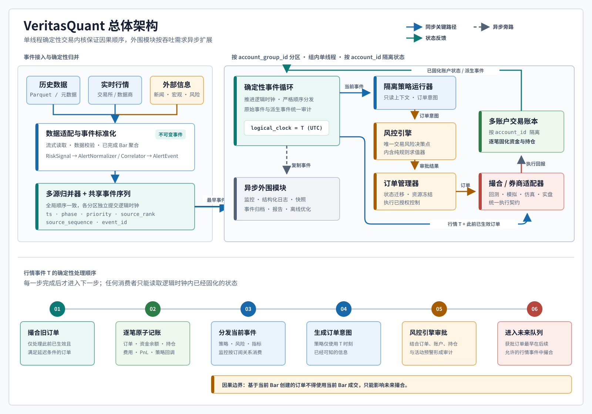
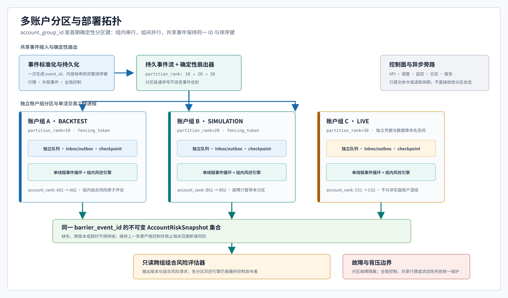
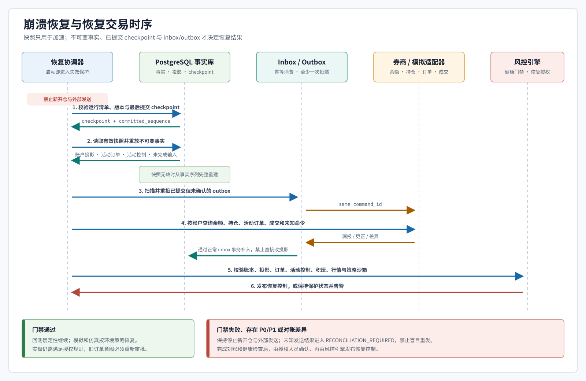

# VeritasQuant 严格事件驱动量化交易平台技术方案

## 1. 文档目的与范围

本文档是 VeritasQuant（简称 VQ）的唯一权威技术设计，定义从策略研究、历史回测、模拟交易、券商仿真到受控实盘的领域契约、模块边界、事件时序、风险控制、执行行为和验收要求。平台面向跨市场、多资产、多策略量化交易，并支持多种基金智能定投方案及用户自定义定投规则的历史回测。首期以分钟级历史行情文件和日级基金净值为主要数据源，支持分钟、小时和日级策略，并以严格因果时序和可校准的执行模型保障验证结果的可信度。

平台目标覆盖范围包括黄金期货（沪金、COMEX）、黄金 ETF（518880、GLD）、黄金矿股 ETF（GDX）、黄金现货（AU9999、国际金）、积存金、A 股、港股、美股个股、境内 ETF、港股 ETF、境内开放式公募基金与 QDII 基金。阶段 1 不同时实现全部目标资产，只固定验证两个代表标的：证券路径使用 `518880`，期货路径使用数据 manifest 明确指定的单一上期所黄金期货交割合约。前者验证 T+1、费用和证券持仓，后者验证合约乘数、保证金、逐日盯市和到期规则；基金定投回测及其余资产按第 14 章能力矩阵逐项启用。

平台的核心目标不是追求单一的回测收益，而是在不存在未来信息、存在真实交易摩擦的前提下，建立可复现、可审计、可逐级验证的策略研发和交易执行基础设施。

## 2. 设计原则

### 2.1 严格因果时序

分钟 Bar 是首期最小时间原子。事件循环处理一条时间戳为 T 的行情事件时，先使用该事件撮合此前已生效的订单，再将事件分发给策略；策略在 T 时刻新建的订单只可在后续事件中进入撮合。任何模式下均禁止使用 T 时刻的数据成交 T 时刻刚产生的订单。

### 2.2 流式数据消费与无未来信息

历史数据以迭代器流式读取，跨文件使用最小堆按事件时间归并。已消费数据只保留在策略受限窗口或归档存储中，引擎不向策略暴露全量历史数据或未来索引。日线仅可在收盘完成后生成，并于下一个可交易时点提供查询。

### 2.3 策略、风控与执行解耦

策略负责从已知事件生成订单意图，风控负责审批与限额，执行层负责订单生命周期、撮合和成交回报。回测、纸上交易、仿真和实盘仅替换数据与执行适配器，策略逻辑和风险规则保持一致。

### 2.4 交易状态即时固化

每笔成交或部分成交必须同步更新账户、资金冻结、持仓、已实现与未实现盈亏。下一次策略决策读取的是该时点的真实可用资源，避免因异步状态或重复下单产生虚假收益。

### 2.5 广义事件驱动

行情、新闻、宏观数据、政策、舆情和极端风险预警统一抽象为带时间戳的事件，在相同的逻辑时钟下归并与分发。回测和实盘使用同一事件协议，以保持策略行为的一致性。

### 2.6 显式建模成交不确定性

理想化回测与真实模式回测必须明确区分。真实模式需要建模提交延迟、成交概率、排队、部分成交、滑点、冲击成本、交易限制与撤单；仿真和实盘成交数据持续校准这些参数。

## 3. 总体架构

### 3.1 组件与关键路径

平台采用单线程确定性事件循环作为每个账户组的交易内核，外围模块可按吞吐需求异步扩展。单线程处理同一 `account_group_id` 内的状态变更，优先保证可复现的时序；不同账户组、数据采集、报告生成、监控写入和离线优化可独立并行。



图中左侧是事件接入与确定性归并区。历史行情、实时行情及新闻、宏观和风险信息先经过数据适配、质量校验和事件标准化；`RiskSignal` 必须经过 `AlertNormalizer` 与 `AlertCorrelator` 才能成为可分发的 `AlertEvent`。多源归并器按版本化排序键 `ts`、`phase`、`priority`、`source_rank`、`source_sequence`、`event_id` 取出最早事件并推进 UTC 逻辑时钟，策略不能绕过该入口读取尚未消费的数据。

图中右侧是同步交易关键路径。确定性事件循环通过序列化 IPC 将只读上下文分发给隔离的策略运行器，策略只返回订单意图；`RiskEngine` 是唯一的交易风险决策点，其内部 `AlertPolicyEngine` 仅执行纯规则求值并返回候选建议，无事件发布权。获批订单和已授权控制交由订单管理器执行。事件循环还会把行情 T 与此前已经生效的订单送入撮合或券商适配器，执行回报先进入多账户交易账本，按 `account_id` 逐笔固化资金、持仓和费用，再把已固化状态及派生事件反馈给事件循环。虚线箭头表示监控、结构化日志、快照、事件归档、报告和离线优化等异步旁路，它们可以复制事件，但不得修改交易状态或作出交易决定。

图下方的六步时序是实现者和自动化智能体必须遵守的因果契约：撮合旧订单、逐笔原子记账、分发当前事件、生成订单意图、运行 `RiskEngine` 审批、把获批订单加入未来撮合队列。每一步完成后才能进入下一步；基于当前 Bar 创建的订单不得使用当前 Bar 成交。若图形表现与文字描述产生歧义，以本段顺序和第 6 章事件循环定义为准。

平台将 `account_id` 作为订单、执行回报、账本分录、账户快照和风险作用域的一等路由键。单次运行可加载多个相互隔离的账户；它们可以订阅同一历史或实时事件流，但分别维护订单队列、资金、持仓、费用、结算和风险状态。账户组或组合视图只能读取各账户已固化的快照，默认不得跨账户轧差、共享保证金或调拨资金。

每个账户组分区维护独立的已提交逻辑时钟，但都消费同一版本化共享事件序列，时钟只能按完整排序键前进，不能因工作进程快慢改变事件顺序。同一共享事件在各分区具有相同目标 `ts`，分区可以暂时落后；跨组读取必须等待第 3.2 节快照屏障，不能把不同已提交时点称为同一组合状态。事件严格按 `ts + phase + priority + source_rank + source_sequence + event_id` 升序形成全序；排序规则由 `EventOrderingVersion` 版本化并写入运行清单，详细契约见第 15 章。

### 3.2 多账户分区与部署拓扑

首期固定使用 `account_group_id` 作为事件循环分区键。每个账户在一次运行中必须且只能属于一个账户组；同组账户共享需要原子评估的组合风险预算和一个逻辑时钟，组内按照版本化 `account_rank` 串行更新，组间由独立 `TradingWorker` 进程并行运行。一个账户组只能包含同一 `execution_mode` 和同一安全环境的账户，`LIVE` 不得与回测、模拟或仿真账户混组。账户组、账户排名、分区排名和工作进程绑定在运行开始后冻结并写入运行清单。



标准化服务只创建一次共享市场事件及 `event_id`，持久化后由确定性扇出器按照 `partition_rank` 升序写入每个账户组的独立持久队列；分区 inbox 键为 `run_id + account_group_id + event_id`。同一共享事件在所有分区保留完全相同的信封、排序键和内容哈希，分区投递序号作为信封外元数据，不能改变事件因果时间。组内再按 `account_rank` 将事件路由给明确订阅的账户，禁止按进程调度或网络到达顺序决定扇出次序。

每个账户组拥有独立 inbox、outbox、checkpoint、活动订单、账本投影和活动控制，并由带 fencing token 的单活租约保证同一时刻只有一个写入者。单一账户或账户组失败时只暂停该分区的新开仓和外部发送，其他分区可继续消费；但共享行情失效、全局 P0/P1 控制、标的级共享流动性分配失败或跨组组合风险门禁失败时，所有受影响分区统一进入保护状态。分区队列采用有界背压：达到告警阈值时禁止新增风险，达到硬上限时停止该分区消费并保留磁盘队列，不得丢弃交易或控制事件。

跨账户组组合风险只读取不可变 `AccountRiskSnapshot`。每份快照必须包含 `account_group_id`、`account_id`、共享 `barrier_event_id`、逻辑 `ts`、账本序号、订单版本、控制版本和内容哈希；组合评估器只有收齐目标集合在同一 `barrier_event_id` 的快照后才能形成 `PortfolioSnapshotSet` 并发布组合风险请求。缺失、版本不一致或超时不得用新旧快照拼接，应维持上一条更严格控制并禁止相关范围新增风险。组合评估器只读，不直接改账户；最终控制仍由各分区 RiskEngine 按同一组合请求和策略版本幂等发布。

## 4. 核心领域模型与事件契约

### 4.1 基础事件

所有事件都应是不可变对象，并带有足够的来源和追溯信息：

```python
class EventEnvelopeV1:
    eventId: str
    eventType: str
    schemaVersion: str        # 事件类型 Schema 的 MAJOR.MINOR 版本
    runId: str
    ts: datetime              # 事件首次可被系统使用的时刻，UTC，精度由运行配置统一
    occurredAt: datetime | None
    publishedAt: datetime | None
    ingestedAt: datetime
    source: str
    producer: str
    producerVersion: str
    correlationId: str
    causationId: str | None
    accountId: str | None
    subaccountId: str | None
    eventOrderingVersion: str
    phase: int
    priority: int
    sourceRank: int
    sourceSequence: int
    payload: BaseModel        # 由 eventType + schemaVersion 唯一确定的强类型模型
    contentHash: str
```

上述 Python 声明中的项目自定义字段使用小驼峰（lowerCamelCase）；事件持久化、总线和 API 的 wire 字段仍由注册 Schema 固定，本文其余契约表使用 wire 名称。Pydantic 模型通过唯一显式 alias 完成映射，不做大小写不敏感匹配，也不改变 `datetime`、`BaseModel` 等标准库或第三方类型名称。

`ts` 是平台统一的事件可用时间字段，表示该事件首次可以被平台消费并影响状态的时刻，而不一定是底层事实发生的时刻。`ts` 必须是带时区的 UTC 时间；运行级配置 `TsPrecision` 支持 `Second` 和 `Millisecond`，默认为 `Second`。一个运行内的事件、日志、持久化字段和 API 必须使用同一精度：秒级序列化采用 `YYYY-MM-DDTHH:mm:ssZ`，毫秒级序列化采用 `YYYY-MM-DDTHH:mm:ss.SSSZ`，秒级来源在毫秒模式下以 `.000` 表示。输入包含毫秒而当前运行配置为秒级时必须校验失败并要求将整个运行切换为 `Millisecond`，禁止隐式取整、截断或四舍五入；超出已支持精度的输入同样拒绝进入事件流。相同 `ts` 的事件按第 15 章完整排序键形成全序。新契约、配置、持久化列和 API 必须统一使用 `ts`，不得保留其他同义字段。

`event_id` 在生产者作用域内不可变且全局唯一；同一业务链共享 `correlation_id`，每个派生事件以直接父事件的 `event_id` 作为 `causation_id`。账户相关事件必须填写 `account_id`，策略分账户相关事件同时填写 `subaccount_id`，不允许依赖消费者上下文补默认账户。`producer + producer_version` 标识创建信封的代码，`schema_version` 标识载荷协议，两者不得混用。

阶段 1 建立版本化 Schema 注册表，键为 `event_type + schema_version`，值至少包含 Pydantic 载荷模型、JSON Schema 内容哈希、兼容范围、确定性升级器和拥有模块。首批必须注册 `MarketBarEvent`、`CorporateActionEvent`、`OrderEvent`、`CancelOrderEvent`、`ReplaceOrderEvent`、`ExecutionReportEvent`、`RiskSignalEvent`、`AlertEvent`、`AlertNormalizationFailureEvent`、`RiskDecisionEvent`、`TradingControlEvent` 和账户账本事件；启用基金定投回测前还必须注册 `FundNavPublishedEvent`、`InvestmentPlanDueEvent`、`FundSubscriptionEvent`、`FundRedemptionEvent` 和 `FundShareConfirmedEvent`。核心事件禁止使用无约束 `dict` 作为最终载荷。未注册事件类型、未知主版本、缺少升级路径或校验失败的事件进入隔离区并生成 Schema 校验审计记录，不得进入交易事件总线。

Schema 版本使用 `MAJOR.MINOR`：同一主版本只能增加带默认值的可选字段、放宽消费者无需理解的枚举或补充非语义元数据；删除/改名字段、改变单位/精度/含义或收紧既有取值必须提升主版本。消费者声明支持范围；已知旧版本先保存原始信封，再用注册的纯函数升级器转换为当前内部版本。升级器不得读取系统时间、网络或可变配置，且输入、升级器版本相同时输出必须相同。系统不自动降级，也不猜测未知版本。

`content_hash` 使用 SHA-256 计算：除 `content_hash` 自身外，信封全部不可变字段和强类型载荷先按字段名 UTF-8 升序、UTC 规范时间、Decimal 规范字符串、数组原顺序和显式 `null` 序列化，再计算哈希。inbox 幂等首先比较作用域内幂等键，再比较 `content_hash`；键相同且哈希相同视为重复投递，键相同但哈希不同视为协议冲突。传输重试次数、队列 offset、处理时间和本地日志上下文属于投递元数据，不得写入信封或参与内容哈希。

首期事件类型如下：

| 类别 | 典型事件 | 作用 |
| --- | --- | --- |
| 行情 | `MarketBarEvent`、`TickEvent` | 推进市场状态与策略数据窗口 |
| 基金 | `FundNavPublishedEvent`、`InvestmentPlanDueEvent`、`FundSubscriptionEvent`、`FundShareConfirmedEvent` | 发布当时可用的基金净值、触发定投计划并记录申购与份额确认 |
| 通用外部事件 | `NewsEvent`、`MacroEvent`、`PolicyEvent`、`AlertEvent` | 提供非价格信息和风险信号 |
| 交易指令 | `OrderEvent`、`CancelOrderEvent` | 表达策略或风控批准的订单意图 |
| 交易回报 | `ExecutionReportEvent`（成交、部分成交、撤单、拒单、更正） | 更新订单、账户和策略状态 |
| 系统事件 | `SessionOpenEvent`、`SessionCloseEvent`、`CorporateActionEvent` | 表达市场时段、公司行为和运行状态 |

订单、撤单、替换、执行回报和交易控制使用第 4.6 节的显式契约与状态机；消费者不得根据事件名称自行推断缺失字段或创建私有迁移。

### 4.2 异构事件体系

新闻、公告、经济指标、政策文件、社交媒体和风险预警按统一协议接入。新闻可包含关联标的、正文摘要、情绪分数、相关性与来源可信度；宏观事件需包含实际值、预期值、前值、意外值和重要度；政策事件记录决议、投票和结构化倾向。

对存在发布或采集延迟的外部信息，`ts` 必须是系统实际可获知的时刻，而非事件发生时刻。`occurred_at` 用于描述事实发生时间，`published_at` 用于描述来源公开时间，`ingested_at` 用于描述平台接入时间。回测按已记录的可用时间归并，杜绝使用事后修订、补采或重新标注的数据。

### 4.3 风控预警标准事件

风险预警不是直接执行交易操作的旁路消息，而是经过标准化、可审计的领域事件。原始风险信号可来自规则检测器、券商或交易所状态、数据质量检查、外部新闻和人工录入；它们先保存原始载荷，再由 `AlertNormalizer` 转换为 `AlertEvent`，最后由事件总线分发给 RiskEngine、策略、监控和通知模块。

```python
class RiskSignal:
    signalId: str                 # 检测器或适配器生成的不可变事实记录
    signalType: str               # 例如 volatility.threshold_breached
    observedAt: datetime          # 被观测数据所属的时刻
    detectedAt: datetime          # 检测器得出结果的时刻
    source: str
    scopeCandidate: dict          # 尚未完成标准化的账户、策略、标的或市场范围
    payload: dict                 # 原始或规则计算结果，不直接驱动交易
    evidence: list[dict]
    confidence: float | None
    ruleId: str | None
    ruleVersion: str | None

class AlertEvent(EventEnvelopeV1):
    eventType: Literal["alert.created", "alert.updated", "alert.resolved"]
    alertId: str                  # 同一预警对象在整个生命周期内保持不变
    alertVersion: int             # 生命周期内从 1 开始严格单调递增
    previousEventId: str | None
    alertType: str                # 受控枚举，例如 market.extreme_volatility
    severity: Literal["P0", "P1", "P2", "P3"]
    status: Literal["ACTIVE", "ACKNOWLEDGED", "SUPPRESSED", "RESOLVED", "EXPIRED"]
    scope: dict                   # accountIds、strategyIds、symbols、markets
    dedupeKey: str                # 告警类型 + 作用范围 + 时间窗口的稳定键
    correlationId: str | None     # 将相关告警聚合为一个风险事件簇
    ruleId: str | None
    ruleVersion: str | None
    trigger: dict                 # 指标值、阈值、方向、观测窗口
    evidence: list[dict]          # 行情、订单、外部来源和计算结果的引用
    recommendedActions: list[str]
    expiresAt: datetime | None
    rawEventIds: list[str]

class AlertNormalizationFailureEvent(EventEnvelopeV1):
    eventType: Literal["risk.alert_normalization_failed"]
    normalizationFailureId: str
    riskSignalId: str
    attemptedSchemaVersion: str
    ruleId: str | None
    ruleVersion: str | None
    errorCodes: list[str]
    rawPayloadHash: str
    quarantineReference: str
    retryable: bool
```

`RiskSignal` 表示检测器的原始事实，不直接改变交易权限；`AlertEvent` 表示关联、去重、分级后可被全系统消费的预警。`event_id` 标识一次不可变的事件，`alert_id` 标识一个预警生命周期，`alert_version` 标识该生命周期的状态序列。创建事件固定为版本 1，之后每次升级、确认、抑制、恢复、过期或解除必须递增 1 并引用 `previous_event_id`，不能原地覆写历史记录。同一 `(alert_id, alert_version)` 且内容哈希相同视为重复投递；版本更低时保留投递审计但不更新投影；版本出现缺口时进入等待队列并请求重放，缺口补齐前不得应用更高版本；同版本不同哈希属于协议冲突。`RESOLVED` 和 `EXPIRED` 是终态，后续同类风险必须创建新的 `alert_id`。

`AlertNormalizationFailureEvent` 是独立系统审计事件，不属于 `AlertEvent` 生命周期，不得参与预警去重、严重度计算或交易控制。它保存失败输入的哈希、隔离引用、规则版本和结构化错误码；可重试失败在规则或 Schema 修复后产生新的标准化尝试，但不能覆盖失败记录。原始敏感载荷仍只保存在受控隔离区，事件中不得复制未脱敏内容。

预警生命周期迁移固定如下：

| 当前状态 | 输入事件 | 下一状态 | 版本与约束 |
| --- | --- | --- | --- |
| 不存在 | `alert.created` | `ACTIVE` | `alert_version = 1` |
| `ACTIVE` | `alert.updated`（确认） | `ACKNOWLEDGED` | 版本加 1；不解除交易控制 |
| `ACTIVE` / `ACKNOWLEDGED` | `alert.updated`（抑制） | `SUPPRESSED` | 必须有授权原因和 `expires_at` |
| `SUPPRESSED` | `alert.updated`（恢复） | `ACTIVE` | 版本加 1；重新评估风险，不沿用旧建议 |
| `ACTIVE` / `ACKNOWLEDGED` / `SUPPRESSED` | `alert.updated`（升级或补证据） | 原状态 | 版本加 1；严重度不得无恢复依据自动降低 |
| 任一非终态 | `alert.resolved` | `RESOLVED` / `EXPIRED` | 版本加 1；记录解除规则、证据或到期依据 |
| `RESOLVED` / `EXPIRED` | 任意生命周期事件 | 非法 | 拒绝更新；新风险创建新 `alert_id` |

同一预警在抖动时间窗内通过 `dedupe_key` 合并为新的 `alert.updated`，避免重复熔断或通知；关联器必须在提交前以 `alert_id + alert_version` 唯一约束进行并发保护。

预警类型采用分层命名，便于路由和授权：

| 命名空间 | 示例 | 说明 |
| --- | --- | --- |
| `market.*` | `market.extreme_volatility`、`market.limit_move` | 波动、跳价、涨跌停、异常价差 |
| `liquidity.*` | `liquidity.dry_up`、`liquidity.participation_breach` | 成交量枯竭、冲击成本或参与率超限 |
| `portfolio.*` | `portfolio.drawdown`、`portfolio.concentration`、`portfolio.margin_shortfall` | 回撤、集中度、保证金和敞口问题 |
| `execution.*` | `execution.reject_spike`、`execution.stale_order`、`execution.broker_disconnect` | 拒单、超时、券商连接和对账异常 |
| `data.*` | `data.stale_quote`、`data.gap`、`data.outlier` | 行情延迟、缺口、异常值和时钟漂移 |
| `model.*` | `model.drift`、`model.feature_invalid` | 模型漂移、特征缺失或预测失效 |
| `external.*` | `external.policy_shock`、`external.security_incident` | 可验证的外部政策、市场和系统风险 |

严重度表示预期处置级别而非仅通知级别：`P0` 表示立即保护账户或停止交易，`P1` 表示强制降风险并立即升级，`P2` 表示限制新增风险和要求处理，`P3` 表示观察或信息性告警。严重度可因作用范围、持续时间、置信度、重复次数和账户暴露而升级；自动降级仅能由明确的恢复规则或人工确认触发。

### 4.4 策略接口

```python
class BaseStrategy:
    def onBar(self, event): ...
    def onEvent(self, event): ...
    def onFill(self, event): ...
    def onPartialFill(self, event): ...
    def onOrderCancelled(self, event): ...
    def createOrder(self, symbol, side, quantity,
                    orderType="limit", price=None,
                    timeout=0): ...
```

策略只能访问自身订阅的已发生事件、指标窗口、只读标的元数据及当前虚拟分账户。策略禁止直接调用券商接口、修改账户、读取未来数据或绕过 RiskEngine。`StrategyManager` 为每个策略分配独立分账户、订阅集合、参数和风险预算，同时施加组合级的统一限额。

### 4.5 Python 策略隔离与运行契约

GUI 可编辑和上传的 Python 策略一律按不可信代码处理。策略代码不得与交易内核、API 服务、券商适配器或其他账户策略共享进程和可写内存；每个 `strategy_id + strategy_version + account_id` 至少构成一个独立隔离域。事件循环通过受版本控制的序列化 IPC 发送只读 `StrategyContext`，策略运行器只返回 `OrderIntent`、受限日志和指标。任何订单意图都必须由宿主进程重新校验 Schema、账户路由、逻辑时间和大小限制后再进入 `RiskEngine`，策略进程返回的对象不能直接修改内核状态。

威胁模型和强制隔离边界如下：

| 威胁 | 强制边界 | 失败处置 |
| --- | --- | --- |
| 读取未来数据、数据库、其他账户状态或进程内对象 | 上下文只包含当前逻辑时钟内的订阅窗口和本账户只读投影；不挂载数据库套接字，不共享内核对象 | 拒绝调用结果，终止工作进程并记录安全事件 |
| 读取凭据、环境变量或任意文件 | 清空非必要环境变量；策略代码和批准依赖只读挂载；不挂载宿主目录、密钥或用户主目录；临时目录使用有配额的空白文件系统 | 终止工作进程，冻结该策略版本，禁止自动重试 |
| 网络访问、创建子进程或危险系统调用 | 默认禁用网络命名空间；禁止进程创建、调试、设备访问和未批准系统调用；导入模块使用版本化白名单 | 视为越权并产生 `strategy.security_violation` 原始风险信号 |
| 死循环、阻塞、内存耗尽或超量输出 | 使用进程级 CPU、内存、文件描述符、IPC 消息和单次回调期限 | 超限即终止；未完成回调不得产生部分订单意图 |
| 系统时钟、系统熵或全局随机状态导致非确定性 | 只允许宿主注入的逻辑时钟和命名随机源；固定 Python 哈希种子，禁止读取系统时间和系统随机源 | 回放探针不一致时判定运行失败，策略版本不得晋级 |
| 依赖替换、运行中改码或供应链漂移 | 冻结源码、依赖锁、解释器版本和隔离镜像摘要，并校验 SHA-256 | 哈希不一致时拒绝加载，活动运行不得热替换策略代码 |

策略允许 API 采用默认拒绝原则：

| 接口类别 | 允许内容 | 明确禁止 |
| --- | --- | --- |
| 输入 | 当前事件副本、受限历史窗口、只读标的元数据、本账户/分账户已固化快照、逻辑时钟 | 未来游标、可变账户对象、数据库连接、券商客户端、服务容器 |
| 计算 | 批准的 Python 标准库子集、锁定版本的指标/数值库、宿主注入的确定性随机源 | 动态安装依赖、任意导入、反射获取宿主对象、系统时间与系统熵 |
| 输出 | 符合 Schema 的 `OrderIntent`、有限长度的结构化诊断日志和自定义指标 | 订单状态、成交回报、风险决定、交易控制、账户或持仓修改 |

首期默认沙箱配额为每个隔离域 1 个 vCPU、512 MiB 内存、64 个文件描述符、单次回调 1 秒墙钟时间、单次 IPC 输入与输出各 256 KiB，以及每次回调最多 100 个订单意图。配额和允许依赖由 `StrategySandboxPolicyVersion` 版本化，可按模式收紧；任何放宽都必须经基准测试和审批，并写入运行清单。历史回测超时或资源超限使整个运行失败，不能跳过事件继续计算；模拟、仿真和实盘则丢弃本次全部输出、终止工作进程、把策略置为 `SUSPENDED`，并将运行健康事实提交给 `RiskEngine`。是否撤销活动订单或只减仓只能由 `RiskEngine` 决定，策略运行器和进程监管器均无权直接发布交易控制。

研究环境可以使用独立本机进程提升开发便利性，但只有具备等价操作系统隔离的容器或受限执行环境才可进入券商仿真和实盘。实盘策略必须完成静态检查、依赖与漏洞扫描、越权探针和确定性回放，冻结 `strategy_version`、源码哈希、依赖锁哈希、解释器版本、隔离镜像摘要、审批人和审批时间；GUI 对活动版本只读，任何修改必须产生新版本和新审批记录。

### 4.6 订单、执行回报与交易控制契约

订单链路使用强类型模型，所有数量、价格和金额使用 `Decimal`，方向、订单类型、有效期和状态使用受控枚举。阶段 1 的必填字段如下；每个模型同时继承或关联第 4.1 节信封字段。

| 模型 | 必填字段 | 关键约束 |
| --- | --- | --- |
| `OrderIntent` | `intent_id`、`run_id`、`account_id`、`subaccount_id`、`strategy_id`、`strategy_version`、`symbol`、`instrument_metadata_version`、`side`、`position_effect`、`order_type`、`quantity`、`time_in_force`、`ts`、`created_from_event_id`、`expected_account_version` | 只表达策略意图；限价/止损类型按类型要求价格；数量必须符合最小手数，不能携带券商凭据或最终订单状态 |
| `OrderEvent` | `client_order_id`、`intent_id`、`command_id`、`order_version`、`state`、`approved_quantity`、价格字段、`effective_after_event_id`、`risk_decision_id`、`account_id` | `client_order_id` 在账户内唯一；每次迁移严格增加 `order_version`；获批数量不能超过意图数量 |
| `CancelOrderEvent` | `cancel_request_id`、`client_order_id`、可选 `broker_order_id`、`expected_order_version`、`reason`、`requested_by` | 撤单是请求而非已撤状态；重复请求使用同一 ID；目标终态时返回当前结果 |
| `ReplaceOrderEvent` | `replace_request_id`、`client_order_id`、`expected_order_version`、新数量/价格/有效期、`reason` | 首期对不支持原子改单的券商转换为“撤旧单确认后创建新单”，新单使用新 `client_order_id` 并关联被替换订单 |
| `ExecutionReportEvent` | `broker_report_id`、`client_order_id`、可选 `broker_order_id`、`report_sequence`、`execution_type`、`last_quantity`、可选 `last_price`、`cumulative_quantity`、`remaining_quantity`、`broker_state`、原因码及诊断时间 | 成交必须有账户内唯一 `execution_id`；累计量不得下降或超过订单量；最后量为本报告增量，不能用累计量重复记账 |
| `RiskDecisionEvent` | `decision_id`、`request_event_id`、`account_id`、`decision`、`approved_quantity`、`rule_ids`、`risk_policy_version`、账户/订单/持仓快照版本、`reason_codes` | 仅 RiskEngine 发布；输入快照版本必须可审计；同一请求和策略版本只产生一个最终决定 |
| `TradingControlEvent` | `control_id`、`control_version`、`control_request_id`、`idempotency_key`、`scope`、`action`、`strength`、`parameters`、`effective_from`、可选 `expires_at`、`release_conditions`、`source_decision_id`、`risk_policy_version`、`status` | 仅 RiskEngine 发布；版本从 1 单调递增；解除或替换使用新版本，禁止删除或原地放宽 |

订单状态固定为 `NEW`、`PENDING_RISK`、`APPROVED`、`PENDING_SUBMIT`、`SUBMITTED`、`ACCEPTED`、`PARTIALLY_FILLED`、`PENDING_CANCEL`、`CANCELLED`、`FILLED`、`REJECTED`、`EXPIRED` 和 `RECONCILIATION_REQUIRED`。状态迁移表如下：

| 当前状态 | 输入 | 下一状态 | 处理规则 |
| --- | --- | --- | --- |
| 不存在 | 合法 `OrderIntent` | `NEW -> PENDING_RISK` | 原子保存意图；重复 `intent_id` 比较内容哈希 |
| `PENDING_RISK` | 风险批准 / 拒绝 | `APPROVED` / `REJECTED` | 决定、资源预占和订单版本同事务提交 |
| `APPROVED` | 创建命令 outbox | `PENDING_SUBMIT` | 固定 `command_id`，不得在当前 Bar 撮合 |
| `PENDING_SUBMIT` | 发送成功 / 结果未知 | `SUBMITTED` / `RECONCILIATION_REQUIRED` | 网络超时不等于拒单，未知结果禁止生成新命令 ID |
| `SUBMITTED` | 券商受理 / 拒绝 | `ACCEPTED` / `REJECTED` | 保存 `broker_order_id`；拒绝必须释放未使用预占 |
| `ACCEPTED` / `PARTIALLY_FILLED` | 合法增量成交 | `PARTIALLY_FILLED` / `FILLED` | 先按 `execution_id` 幂等记账；累计量等于订单量时 `FILLED` |
| `ACCEPTED` / `PARTIALLY_FILLED` | 撤单请求 | `PENDING_CANCEL` | 保留已成交量，只冻结剩余可撤量 |
| `PENDING_CANCEL` | 增量成交 | `PENDING_CANCEL` / `FILLED` | 撤单与成交竞态时成交优先记账；全成后撤单回报仅作审计 |
| `PENDING_CANCEL` | 撤单确认 | `CANCELLED` | 终态可包含非零累计成交量；只释放剩余预占 |
| 非终态 | 到期 | `EXPIRED` 或 `PENDING_CANCEL` | 内部订单可直接过期；外部活动订单先请求撤单 |
| 任一外部活动状态 | 断线、序列缺口或矛盾回报 | `RECONCILIATION_REQUIRED` | 暂停新副作用，查询券商并通过正常回报恢复 |
| `CANCELLED` / `REJECTED` / `EXPIRED` | 经核验的迟到成交或券商更正 | 保持终态或 `FILLED` | 必须记账并建立更正链；累计量满额时可审计迁移为 `FILLED`，禁止丢弃真实成交 |

重复、乱序和未知回报统一按以下规则处理：`broker_report_id` 或 `execution_id` 相同且哈希相同直接返回已提交结果；相同 ID 不同哈希进入协议冲突；`report_sequence` 小于等于已应用序号时只保留投递审计，不得回退状态；序号出现缺口时缓冲并查询重放，只有连续序列或券商权威快照核验后才能推进。状态迁移始终以 `cumulative_quantity` 不下降、`remaining_quantity = order_quantity - cumulative_quantity` 为不变量。无法关联 `client_order_id` 的回报进入未知订单隔离区并触发券商查询，禁止凭回报自动创建本地订单。断线重放复用原 `broker_report_id`、`execution_id` 和报告序号。

同一作用范围内的交易准入控制使用以下强度偏序，数值越大越严格：

| 强度 | `action` | 合并语义 |
| ---: | --- | --- |
| 0 | `ALLOW` | 仅在不存在其他活动控制时有效 |
| 10 | `LIMIT_QUANTITY` | 数量上限取所有活动控制的最小值 |
| 20 | `BLOCK_OPENING` | 禁止增加风险，允许普通平仓 |
| 30 | `REDUCE_ONLY` | 订单执行后风险暴露必须严格下降 |
| 40 | `PAUSE_SCOPE` | 暂停指定策略、账户、标的或市场的新订单 |
| 50 | `STOP_TRADING` | 停止作用域内全部自动发单，只允许经单独授权的应急动作 |

`CANCEL_ACTIVE_ORDERS`、通知升级和人工确认是与准入强度正交的控制参数：布尔参数取逻辑或，允许标的集合取交集，数量/敞口上限取最小值。不同作用域先展开到具体账户、策略和标的，再对每个目标取最大强度；任何控制的确认、到期或解除只移除该来源贡献，不能覆盖其他活动控制。控制版本乱序规则与 `AlertEvent` 相同，OMS 只执行已提交、版本最新且作用域匹配的控制。

## 5. 数据管理与回放

### 5.1 数据规范

分钟行情首选 Parquet，CSV 只作为原始接入兼容格式，不能直接进入回放。原始层按来源字节原样、只追加保存；规范化层固定发布 `MinuteBarSchemaV1`。默认秒精度 profile 使用 Arrow `timestamp[s, tz=UTC]`，毫秒运行使用独立的 `timestamp[ms, tz=UTC]` profile，禁止在读取时隐式转换精度。字段如下：

| 列名 | Arrow/Parquet 类型 | 可空 | 语义与约束 |
| --- | --- | --- | --- |
| `ts` | `timestamp[s, tz=UTC]` 或 `timestamp[ms, tz=UTC]` | 否 | Bar 完成且平台首次可使用的时间，符合 manifest 的 `TsPrecision` |
| `bar_start` / `bar_end` | 同 `ts` profile | 否 | 事实窗口边界，`bar_start < bar_end <= ts`，不能替代事件可用时间 |
| `symbol` / `market` | UTF-8 string | 否 | 规范化标的和市场代码，必须匹配标的映射版本 |
| `open` / `high` / `low` / `close` | `decimal128(38, 12)` | 否 | 正数、符合 tick，且 `low <= open/close <= high` |
| `volume` | `decimal128(38, 12)` | 否 | 非负基础数量；单位由标的元数据固定 |
| `amount` | `decimal128(38, 8)` | 是 | 来源未提供时为 null，禁止用 0 冒充缺失 |
| `trade_count` | `int64` | 是 | 来源成交笔数；未知为 null |
| `currency` / `session_id` | UTF-8 string | 否 | 计价币种与版本化交易会话标识 |
| `source` / `source_record_id` | UTF-8 string | 否 | 来源及原始记录追溯键 |
| `source_sequence` | `uint64` | 否 | 来源内严格单调序号 |
| `is_adjusted` | bool | 否 | 是否复权；复权数据不得用于模拟真实下单价格 |
| `adjustment_version` | UTF-8 string | 是 | 复权规则版本；未复权时为 null |
| `instrument_metadata_version` | UTF-8 string | 否 | 日历、tick、手数、乘数和结算规则版本 |
| `quality_flags` | `uint32` | 否 | 受控位标志；0 表示通过全部强制校验 |

规范化数据集内主键为 `market + symbol + bar_start + bar_end + source`，不得重复；文件按该键和 `source_sequence` 稳定排序，并使用固定行组大小、压缩算法和写入器版本。价格、数量和金额禁止使用 float；CSV 中的数值先按字符串解析为 Decimal，空字符串、NaN 和 Infinity 均校验失败。规范化逻辑路径使用 `{DatasetId}/{Market}/{Symbol}/Year={YYYY}/Month={MM}/{ContentHash}.parquet`，物理存储 URI 不参与业务逻辑。

原始、规范化和隔离层严格分离：原始对象以来源内容哈希寻址且永不覆盖；规范化文件只引用原始对象；失败记录进入隔离 manifest。供应商更正、标的映射修订、复权变化或质量规则变化必须生成新数据版本和新文件，旧 manifest 保持可读取，禁止原地覆盖或把事后修订注入旧回测。

每个数据版本由不可变 `DataManifestV1` 定义，至少包含 `SchemaId/SchemaHash`、`TsPrecision`、按逻辑路径排序的文件 SHA-256/行数/最小最大主键、原始对象哈希、标的映射版本、标的元数据版本、日历版本、复权策略版本、质量规则版本、隔离记录哈希与数量、转换代码/依赖版本、可选 `SupersedesDataVersionId` 和结构化修订原因。`data_version_id` 是对身份字段规范化 JSON 计算的 SHA-256；存储 URI、下载时间、本机绝对路径、签名和备注不参与身份哈希。数组按协议指定键排序，Decimal、UTC 时间和 null 按第 4.1 节规范化。

数据加载器先验证 manifest 自身哈希、每个文件内容哈希和所有引用版本，再按稳定主键生成 `source_sequence` 与事件。相同 manifest 和文件字节在不同机器、操作系统和存储路径上必须产生相同 `data_version_id`、事件内容哈希和完整事件序列；任何文件、Schema、日历、映射、修订或隔离集合变化都必须得到新的数据版本 ID。标的注册表独立维护市场、币种、价格最小变动、交易时段、手续费、合约乘数、保证金、涨跌停和结算规则。

### 5.2 MVSV-1 历史行情导入

历史行情导入器必须支持仓库样本 `Data/US_NSDQ_NVDA/US_NVDA_Min_V4_2026_2026072907_15000.mvsv` 所使用的 `MVSV-1` 文本格式。`.mvsv` 是外部来源协议：源文件字段和头键严格按来源大小写保留，只能在 `infrastructure/market_data` 适配器边界映射到 `MinuteBarSchemaV1`，不得将 `ts|dt|o|c|l|h|v|t|cp|cr|p` 等缩写扩散为项目配置或 Python 领域字段。

解析器接受 UTF-8（允许 BOM）以及 LF/CRLF 换行。文件由若干 `# Key : Value` 头行、一个空行和管道符分隔的数据行组成；引号内文本按 UTF-8 字符串解析，整数和 Decimal 必须先按字符串严格转换，禁止经 float 中转。`MVSV-1` 必填头为 `Format`、`Field`、`Count`、`EffectiveTimeZone`、`Code`、`Market`、`CurrencyCode`、`PriceAccuracy` 和 `LotSize`，其中 `Format` 必须严格区分大小写并等于 `MVSV-1`，`Field` 必须精确声明 `ts|dt|o|c|l|h|v|t|cp|cr|p`；未知头原样保存到来源元数据，不能据此改变既定字段语义。

字段映射和可用时间规则如下：

| MVSV-1 字段 | 适配规则 |
| --- | --- |
| `ts` | Unix 秒级 UTC，只表示来源 Bar 标签；不得直接假定为平台事件 `ts` |
| `dt` | `yyyyMMddHHmmss` 本地墙钟时间；使用 `EffectiveTimeZone` 的 IANA 时区和 DST 规则反向校验来源 `ts` |
| `o` | 当前 Bar 开盘价，映射为规范化 `open`；使用 Decimal 解析且必须为正数 |
| `c` | 当前 Bar 收盘价，映射为规范化 `close`；使用 Decimal 解析且必须为正数 |
| `l` | 当前 Bar 最低价，映射为规范化 `low`；使用 Decimal 解析且必须为正数，并满足 `l <= o` 且 `l <= c` |
| `h` | 当前 Bar 最高价，映射为规范化 `high`；使用 Decimal 解析且必须为正数，并满足 `h >= o` 且 `h >= c` |
| `v` | 当前 Bar 成交量，映射为规范化 `volume`；使用 Decimal 解析且必须为非负数，数量单位由版本化标的元数据确定 |
| `t` | 成交额。源文件保存的是来源编码后的成交额原值；只有显式配置并版本化 `TurnoverScale` 后才计算规范字段 `amount = t / TurnoverScale`，未配置时保留原值、令 `amount = null` 并设置质量标志，禁止猜测缩放因子或货币单位 |
| `p` | 来源定义的前收盘价；连续 Bar 内应与上一条记录的 `c` 一致，交易时段边界处按来源契约和版本化交易日历校验 |
| `cp` | 当前 Bar 收盘价 `c` 相较于前收盘价 `p` 的价格变化值，即 `cp = c - p` |
| `cr` | 当前 Bar 收盘价 `c` 相较于前收盘价 `p` 的变动率。当前 `MVSV-1` 样本按 `cr = (c - p) / c * 100`（等价于未舍入变化值除以 `c`）编码，单位为 `%`（百分点），不是小数比率；不得擅自替换为常见的前收盘价分母公式 |

来源头未声明分钟标签代表区间开始还是结束，因此每个数据源配置必须显式给出 `BarLabelMeaning: Start|End`，缺失时拒绝导入。`Start` 模式计算 `bar_start = sourceTs`、`bar_end = sourceTs + BarInterval`；`End` 模式计算 `bar_end = sourceTs`、`bar_start = sourceTs - BarInterval`。两种模式均计算平台可用时间 `ts = bar_end + AvailabilityDelaySeconds`；秒级来源进入毫秒运行时补 `.000`，不得把毫秒运行中的其他事件降精度。`BarLabelMeaning`、`TurnoverScale` 和可用延迟必须来自数据供应方契约或经签署的数据分析结论并写入数据 manifest，不能仅依据文件名、相邻行或样本数自动推断。

导入前必须验证头部 `Count` 与实际记录数一致、每行恰有 11 列、`ts` 与 `dt` 时区换算一致、时间和来源序号严格递增、主键无重复、OHLC 合法、成交量与成交额非负、标的/市场/币种映射存在及交易会话可解释。同一连续交易时段内相邻记录的差值必须等于 `BarInterval`，并校验本行 `p` 与上一行 `c` 的衔接；更大的缺口必须由版本化交易日历解释并产生明确质量结果。`cp` 和 `cr` 使用未降精度的 Decimal 按上述公式重算，并在来源契约或导入规则版本规定的绝对容差内比较；`p <= 0`、超出容差或无法解释的衔接差异均进入隔离区，禁止静默修正。失败文件或记录进入隔离 manifest，不得静默跳过。每条规范记录保留原始文件 SHA-256、来源相对路径和 1 基来源数据行号；批量扫描目录时按规范化相对路径再按内容哈希排序，确保不同文件系统产生相同导入顺序。

程序配置模板如下。模板有意不猜测 `BarLabelMeaning` 和 `TurnoverScale`：正式导入前必须依据来源契约把 `BarLabelMeaning` 改为 `Start` 或 `End`；`TurnoverScale` 可保持 `null`，此时导入器只保留 `t` 原值并将规范 `amount` 置空：

```yaml
MvsvImport:
  Format: MVSV-1
  InputPaths:
    - Data/US_NSDQ_NVDA
  FilePattern: "*.mvsv"
  BarInterval: PT1M
  BarLabelMeaning: null
  AvailabilityDelaySeconds: 0
  TurnoverScale: null
  TsPrecision: Second
```

配置固定存放于 `Configs/DataImports/NvdaMvsv.yml`，通过 `vq-import-market-data --config Configs/DataImports/NvdaMvsv.yml` 导入到不可变原始层和规范化 Parquet 层。命令必须先输出待处理文件、配置哈希和来源契约版本的 dry-run 摘要，只有校验通过才提交 manifest；`Data/` 是本地或显式挂载的原始输入目录，不进入 wheel，也不得被运行时隐式搜索。

### 5.3 流式归并与日线合成

每个行情文件和异构事件文件提供顺序迭代器；归并器将各迭代器的当前元素放入最小堆，每次只弹出最早事件并读取该来源的下一条记录。该设计在多标的、长周期回测时控制内存占用，并能自然对齐外部事件。

日线聚合器基于已完成分钟 Bar 在会话收盘后生成 OHLCV。策略在次一有效交易时点可通过受限 API 获取 `getDailyBars(symbol, n)`；当日未收盘的日线不得查询。小时线也由收到的分钟 Bar 在整点或交易时段边界完成聚合。

### 5.4 数据质量控制

导入与回放前执行时间顺序、重复、缺失、OHLC 合法性、成交量非负、交易时段匹配、币种和标的映射检查。异常记录进入隔离区而非静默修正。回测报告必须注明数据版本、时间范围、缺口处理方式和所有外部事件的可用性口径。

### 5.5 基金净值、状态与估值数据

基金历史回测使用不可变 `FundNavSchemaV1`，不能把净值归属日期当作数据可用时间。规范化字段如下：

| 字段 | 类型 | 语义与约束 |
| --- | --- | --- |
| `ts` | UTC 时间 | 该净值记录发布并被平台接收后首次可用于策略的时刻，符合运行级 `TsPrecision` |
| `nav_date` | date | 净值归属日，只描述基金资产估值日期，不参与替代 `ts` |
| `published_at` | UTC 时间或 null | 来源实际公布时间；缺失时必须应用版本化保守 `NavAvailabilityPolicy` |
| `ingested_at` | UTC 时间 | 平台首次接收原始记录的时间，必须满足 `ts >= ingested_at` |
| `symbol` | UTF-8 string | 规范化基金代码，必须匹配基金元数据版本 |
| `fund_type` | 受控枚举 | ETF、LOF、股票、混合、债券、指数、联接、货币或 QDII 等能力类型 |
| `currency` | UTF-8 string | 净值和申赎使用的币种 |
| `unit_nav` | Decimal | 单位净值，必须为正数，不得使用 float |
| `accumulated_nav` | Decimal 或 null | 累计净值；缺失不得以单位净值冒充 |
| `subscription_status` | 受控枚举 | 开放、暂停、限额或关闭，必须带状态生效时间和来源版本 |
| `redemption_status` | 受控枚举 | 开放、暂停、限额或关闭，必须带状态生效时间和来源版本 |
| `source` | UTF-8 string | 数据来源标识 |
| `source_sequence` | uint64 | 来源内稳定序号，用于确定性排序和幂等 |
| `fund_metadata_version` | UTF-8 string | 基金日历、截止时间、费率、份额精度、确认和结算规则版本 |
| `quality_flags` | uint32 | 缺失发布时间、估算值、修订、状态缺口等受控质量标志 |

单位净值、累计净值、分红和拆分必须能在同一版本中一致重建持有份额和总回报，不得用事后复权序列直接替换当时可交易净值。供应商修订产生新的原始对象、规范化文件和 manifest，并通过 `SupersedesDataVersionId` 关联旧版本，禁止覆盖已用于回测的净值。只有 `nav_date` 而缺少 `published_at` 的历史源必须使用保守可用时间，例如下一基金交易日开盘；策略报告必须显示该假设及受影响记录数。

PE/PB、指数估值分位、跟踪指数行情和基金状态分别使用版本化数据集，并保留 `occurred_at`、`published_at`、`ingested_at` 与统一 `ts`。分位数只能由当前 `ts` 之前已发布的历史窗口增量计算，不能使用回测结束后对全样本重新计算的分位边界。基金净值、估值、状态、日历和费率 manifest 共同参与定投运行的 `data_version_id`。

## 6. 事件循环与防前视机制

对于任意事件时间 T，主循环执行如下逻辑步骤。持久化不是末尾的单独补写动作；每个产生领域状态的阶段都按 6.1 节事务边界提交，只有提交成功才能进入下一阶段：

1. 从归并器取出最早事件，推进逻辑时钟至 T。
2. 若为行情事件，撮合此前已经生效且满足延迟条件的订单；产生的成交、部分成交、拒单或撤单先原子提交订单、账本、账户投影与派生事件，再回调策略。
3. 将当前事件按订阅关系分发给策略、指标、风险预警和监控模块。
4. 隔离策略运行器根据当前已知状态生成订单意图；宿主校验后由 RiskEngine 逐条审批。
5. 风险决定、活动控制、资源冻结、订单迁移和待发布命令原子提交；获批订单最早在未来允许的行情事件中生效，不在本轮撮合。
6. 事务外盒发布器异步投递已提交的事件和命令；当前阶段的完成 checkpoint 只有在所有必需领域写入和 outbox 记录提交后才推进。

防前视由架构与测试共同保证：策略数据窗口只追加；访问接口校验查询时间不大于逻辑时钟；回测数据读取器不支持随机跳转至未消费区间；回归测试随机插入未来探针和重排无关事件，验证结果不受未来数据影响。随机撮合使用显式种子，种子、配置和数据版本均写入运行元数据。

### 6.1 事务一致性与幂等边界

所有可重试输入先进入持久化 inbox。inbox 记录原始载荷哈希、幂等键、接收序号、处理状态和首次/最近尝试时间；相同幂等键且载荷哈希一致时返回已提交结果，哈希不一致时视为协议冲突并停止该分区。领域状态与待发布的事件或命令必须写入同一 PostgreSQL 事务中的 outbox，提交后由发布器按至少一次语义投递；消费者继续使用 inbox 去重。因此平台承诺“领域提交后最终可投递”和“幂等处理”，不宣称跨数据库与券商网络的分布式恰好一次。

交易主链路的事务边界固定如下：

| 输入或动作 | inbox 幂等键 | 同一数据库事务内必须提交 | 提交后的外部动作 |
| --- | --- | --- | --- |
| 标准行情、外部事件或 `AlertEvent` | `run_id + account_group_id + event_id` | inbox、原始/标准事件、当前阶段派生事件、阶段 checkpoint、事件 outbox | 事件总线按 outbox 顺序投递；重复消费返回原提交结果 |
| 成交或部分成交回报 | `account_id + execution_id` | inbox、订单状态迁移、不可变账本分录、资金/持仓投影、费用与盈亏、派生事件、阶段 checkpoint、outbox | 发布已提交的执行和账户事件；策略只读取提交后的状态 |
| 撤单、拒单或其他券商回报 | `account_id + broker_report_id` | inbox、订单迁移、资金解冻、原因、派生事件、阶段 checkpoint、outbox | 发布已提交状态；无持仓变化时不得生成虚假账本分录 |
| 订单意图审批与入队 | `run_id + account_id + intent_id` | inbox、`RiskDecisionEvent`、资源预占、订单状态、未来生效序号、阶段 checkpoint、订单命令 outbox | 回测/模拟适配器读取命令；外部适配器使用同一 `command_id` 发送 |
| 预警触发、人工风控命令或控制重算 | `run_id + control_request_id + policy_version` | inbox、风险决定、`TradingControlEvent`、活动控制投影、受影响订单动作、阶段 checkpoint、控制/订单 outbox | OMS 和券商适配器仅执行 outbox 中已授权、版本最新的控制 |
| 券商发送结果、查询结果与对账差异 | `account_id + broker_report_id` | inbox、命令尝试记录、订单映射/迁移、对账状态、派生事件、checkpoint、outbox | 继续查询未知结果或触发风控；不得盲目重复创建新订单 |

账本分录、订单迁移、风险决定和交易控制是恢复事实源，账户余额、持仓、活动订单和活动控制是由已提交事实构建的投影。所有表必须携带 `run_id`、`account_id`、提交序号及关联 inbox/outbox ID；`execution_id`、`intent_id`、`control_request_id` 和 `command_id` 在各自作用域内建立唯一约束。数据库不支持所需原子性时不得启用该交易模式。

券商网络调用和消息发布严禁放入数据库事务。外部订单或控制在发送前必须先以稳定 `command_id` 写入 outbox；适配器可以重发同一个命令，但不能为重试生成新 ID。券商支持幂等键时必须透传 `command_id`；不支持或发送结果未知时，订单进入 `RECONCILIATION_REQUIRED`，先查询并对账，确认券商侧不存在后才能经授权重发。控制执行同样记录目标版本和作用范围，旧版本或较宽松控制不得覆盖仍然活跃的严格控制。

### 6.2 Checkpoint、快照与崩溃恢复

`EventProcessingCheckpoint` 至少记录 `run_id`、`partition_id`、完整事件排序键、`phase`、最后提交序号和事务 ID。checkpoint 与对应领域写入及 outbox 必须同事务提交，不能先推进位点再补写状态。账户快照只用于加速读取和恢复，必须标记 `snapshot_id`、事实序列上界、checkpoint 和内容哈希；它由已提交账本及订单/控制序列派生，可以丢弃重建，不能成为唯一事实源或独立推进消费位点。



恢复流程固定为：

1. 进程启动即进入失效保护状态，停止新开仓和外部命令发送，加载并校验运行清单、Schema、`TsPrecision`、`EventOrderingVersion`、风险策略及沙箱策略版本。
2. 读取每个分区最后已提交的 checkpoint；选择不超过该序列的有效快照，再从不可变账本、订单迁移、风险决定和控制序列重放至 checkpoint。快照缺失或哈希不符时从事实序列重建。
3. 恢复未终结订单、资金预占、未解除 P0/P1 控制、策略暂停状态和未完成 inbox；扫描 outbox，重新投递已提交但未确认的事件与命令，消费者按幂等键去重。
4. 对 `PAPER`、`SIMULATION` 和 `LIVE` 账户逐一查询券商余额、持仓、活动订单、成交和命令状态，把漏报或更正回报通过正常 inbox 事务补入；任何未知发送结果、账本差异或跨账户映射冲突均保持 `RECONCILIATION_REQUIRED`，不得自行猜测或覆盖本地事实。
5. 执行健康门禁：账本平衡、资金与持仓投影可重建、订单与券商一致、活动控制已加载、inbox 无协议冲突、outbox 无阻断积压、行情新鲜且策略沙箱健康。失败时保持保护状态并告警。
6. 回测可在门禁通过后从 checkpoint 确定性继续；模拟和仿真按环境策略恢复；实盘以及存在 P0/P1 或对账差异的运行必须由授权人员确认后，才能由 `RiskEngine` 发布恢复控制。恢复前积累的旧订单意图不得越过重新审批直接发送。

必须在上述每个数据库提交前后、outbox 发布前后、券商发送返回未知以及快照写入期间执行崩溃注入。恢复验收以事实序列为准：订单、账本、风险决定和控制无丢失、无重复，余额与持仓重放结果一致，outbox 最终完成或进入可见的人工处置状态，快照可删除重建，且同一输入和 checkpoint 产生同一后续序列。

## 7. 执行、撮合与双轨绩效评估

### 7.1 执行适配器

执行层向上提供统一的订单和回报协议，向下分为四种适配器：

| 适配器 | 用途 | 成交来源 |
| --- | --- | --- |
| BacktestBroker | 历史回测 | 内部撮合引擎 |
| PaperBroker | 基于后续数据的模拟跟踪 | 内部撮合引擎与增量数据 |
| SimulationBroker | 券商仿真环境 | 仿真 API 回报 |
| LiveBroker | 生产交易 | 券商 API 回报 |

平台支持多个账户分别运行历史回测、基于历史或增量数据的模拟交易、券商仿真和受控实盘。每个 `account_id` 在一次运行中只能绑定一个执行适配器实例和一个不可变的 `execution_mode`（`BACKTEST`、`PAPER`、`SIMULATION` 或 `LIVE`）；切换模式必须创建新运行并重新校验账户初始状态，不得在运行中把模拟账户原地切换为实盘账户。同一部署可以登记和观察多个模拟、仿真及实盘账户，但执行进程、数据库命名空间和凭据必须按环境隔离，订单不得跨环境路由。

策略和风控不感知适配器差异。LiveBroker 默认禁用，只有显式列入实盘白名单的账户才能启用；它还必须具有凭据隔离、幂等下单、重连、订单对账、限频、熔断和人工紧急停止能力。

### 7.2 理想模式

理想模式用于尽早评估信号逻辑的理论上限：市价单按下一根允许成交 Bar 的开盘价完全成交，限价单在价格触及时按不劣于限价的价格完全成交，除显式配置的手续费外不引入延迟、滑点和部分成交。理想模式仍必须使用下述版本化 Bar 内路径、跳空和价格保护规则，不能在同一 Bar 内按对策略最有利的顺序选择触发；它只忽略成交量竞争和执行摩擦。其指标仅用于筛选、诊断和参数探索，不能作为实盘预期。

### 7.3 真实模式的撮合模型

真实模式的默认策略采用保守参数，模型由以下层次组成：

1. **提交延迟**：订单创建后经过 `delay_bars` 才可进入撮合队列，默认至少为一根 Bar。
2. **触及与路径**：按 `BarPathModelVersion` 的确定性价格路径处理限价、止损、止盈和 OCO 竞态，不得只凭 `high/low` 为每个订单独立选择有利结果。
3. **成交概率与排队**：可选择固定概率、共享成交量参与率或历史分布采样。成交概率与估计排队量、Bar 成交量和全局订单优先级相关。
4. **部分成交**：所有账户和策略共享标的-Bar 可成交量池，任何单一订单及总成交均不得突破版本化参与率上限；剩余限价单继续挂单，市价单按配置撤销或拆分重试。
5. **滑点与冲击成本**：市价单在可用价格上叠加固定滑点和波动率/参与率相关成本；限价单可配置价差成本。
6. **过期、停牌与限制**：超过 `timeout` 的订单自动撤销；停牌、涨跌停、非交易时段、资金不足和风险规则均可导致拒单或延迟。

#### 7.3.1 Bar 内路径、跳空与价格保护

仅有分钟 OHLC 时无法知道真实逐笔路径。阶段 1 默认使用 `DIRECTIONAL_OHLC_V1`：`close >= open` 时路径为 `open -> low -> high -> close`，`close < open` 时为 `open -> high -> low -> close`；平盘归入第一种。每一线段按起点到终点单调移动，订单在路径首次触及时处理。该假设不代表真实市场或绝对保守，只提供跨机器一致的默认值；若有逐笔数据则使用独立的 `TICK_REPLAY_V1`，报告不得混合两种结果。`BarPathModelVersion`、路径代码和数据粒度写入运行清单与报告。

触价和跳空矩阵如下：

| 订单类型 | 正常触发 | Bar 开盘跳空 | 成交价格保护 |
| --- | --- | --- | --- |
| 市价单 | 下一允许 Bar 开盘即有资格 | 按开盘可用价处理 | 加保守滑点/冲击后按 tick 量化 |
| 买入限价 | 路径价格首次 `<= limit_price` | `open <= limit_price` 时开盘触发 | 成交价不得高于限价，可按开盘价获得改善 |
| 卖出限价 | 路径价格首次 `>= limit_price` | `open >= limit_price` 时开盘触发 | 成交价不得低于限价，可按开盘价获得改善 |
| 买入止损 | 路径价格首次 `>= stop_price` | `open >= stop_price` 时开盘触发 | 转为市价，不能假设按止损价成交 |
| 卖出止损 | 路径价格首次 `<= stop_price` | `open <= stop_price` 时开盘触发 | 转为市价，不能假设按止损价成交 |
| 止损限价 | 先触发 stop，再按限价规则排队 | 开盘越过 stop 只表示激活 | 若开盘越过 limit 且不满足限价保护，可不成交并继续挂单 |

同一 OCO 组的止损和止盈都落在 Bar 范围内时，以路径首次触发者成交并立即取消同组剩余订单；不存在路径模型无法判定时，使用对当前持仓更不利的结果并记录 `AMBIGUOUS_TRIGGER`。市场涨跌停、停牌或无成交量时，即使价格范围表面触及也必须按市场规则拒绝或延迟。派生限价按买入向下、卖出向上舍入到 tick；买入止损向上、卖出止损向下舍入；数量始终向下舍入到最小手数。输入价格不在 tick 上时校验失败，禁止静默使用二进制浮点修正。

#### 7.3.2 共享成交量池与确定性分配

回测和模拟的内部撮合为每个 `market_event_id + symbol` 建立唯一 `SharedLiquidityPool`。可分配数量为 `floorToLot(bar.volume * GlobalMaxParticipationRate)`；缺失、负数或质量失败的成交量使真实模式禁止成交。单订单还受 `OrderMaxParticipationRate`、剩余数量、资金、持仓和风险控制约束，但所有订单分配之和必须小于等于共享池，不能让每个账户分别使用完整 Bar 成交量。

纯函数 `LiquidityAllocator` 在阶段 10 开始前读取所有账户组已提交且在该 Bar 前生效的订单快照，按以下全局键排序：市场单优先于可成交限价单；限价单按价格优先；同价格按 `effective_ordering_key`、`account_group_rank`、`account_rank`、`client_order_id` 升序。逐单分配 `min(订单剩余量, 单订单参与上限, 池剩余量)` 并向下取整到最小手数，池不足一个最小手数时停止。分配结果形成不可变 `LiquidityAllocationPlan`，包含输入订单快照哈希、池数量、每单分配、未分配原因和 `LiquidityAllocationVersion`，再由各分区在阶段 20 原子记账。任何分区缺失订单快照、计划哈希不一致或分配器失败时，受影响标的本 Bar 不成交并进入保护状态，不允许各分区自行补算。

同一次回测必须同时产出理想与真实模式的权益曲线、收益、年化波动、夏普、最大回撤、Calmar、胜率、盈亏比、换手、未成交率、部分成交率、平均延迟和滑点。报告须显示真实收益相对理想收益的摩擦损耗，并记录 `ExecutionModelVersion`、`BarPathModelVersion`、`LiquidityAllocationVersion`、全局/单订单参与率、tick/手数规则及随机种子。策略能否晋级按第 13 章量化 gate 判定，不得只用“保持正期望”作结论。

### 7.4 校准闭环

仿真和实盘使用独立的高精度诊断字段记录订单发送、受理、成交、撤单与拒绝的时间和原因。离线任务按标的、订单类型、交易时段和市场状态统计延迟、成交概率、部分成交率和滑点分布，生成候选撮合参数；候选参数须经固定历史样本回测和版本对比批准后才能成为默认值，避免用同一实盘样本直接过拟合。诊断时间不替代事件可用时间 `ts`，也不参与事件因果排序。

### 7.5 基金申购赎回执行模型

交易所挂牌基金和场外开放式基金必须使用不同执行能力。ETF、LOF 等场内交易继续通过标准订单、撮合和成交回报契约处理；普通开放式基金、联接基金和 QDII 等场外产品使用 `FundExecutionAdapter`，按申购金额或赎回份额提交申请，不得套用股票的 Bar 内触价、成交量池或“下一根 Bar 开盘成交”规则。

场外申购状态机固定为 `CREATED -> ACCEPTED -> WAITING_NAV -> CONFIRMED`，并允许从非终态进入 `REJECTED` 或在渠道规则允许时进入 `CANCELLED`。申请必须记录基金、账户、计划实例、申请金额、币种、渠道、提交日、截止时间、费用规则版本和幂等键；受理时冻结资金，但只有 `FundNavPublishedEvent` 的 `ts` 已到达、适用净值已按基金日历确定且份额确认事件提交后，才能增加持仓并结转现金和费用。拒绝、额度不足、暂停申购或确认失败必须释放或退回资金并保留完整状态历史。

场外赎回状态机固定为 `CREATED -> ACCEPTED -> WAITING_NAV -> WAITING_SETTLEMENT -> CONFIRMED`，并显式记录赎回份额、适用净值、费用、到账金额和结算日。基金元数据必须版本化申购/赎回截止时间、未知价规则、净值公布延迟、份额确认天数、到账天数、最低/最高金额、份额精度、费率阶梯、申购状态、分红方式、巨额赎回和 QDII 汇率规则。历史回测只能使用当时实际发布且平台已可获得的净值与状态；事后补录的当日净值不能回填为申请时已知价格，估算净值也必须作为独立来源和事件版本保存。

同一申请使用 `account_id + investment_plan_id + due_event_id + operation` 形成幂等作用域。基金申请、资金冻结、份额确认、费用和账本分录使用第 6.1 节事务/outbox 边界；重放、确认延迟或来源修订不得产生重复份额。场外基金执行报告单独统计申请成功率、确认延迟、未知价偏差、实际费率、额度拒绝和结算等待，不与场内订单滑点混为同一指标。

## 8. 账户、资金与风险控制

### 8.1 账户账本与控制边界

账户账本同时维护现金、冻结现金、可用资金、持仓、持仓成本、保证金、应收应付结算、已实现和未实现盈亏。多币种账户以配置的基础币种汇总，并对汇率时间和来源做版本化记录。期货按保证金和逐日盯市处理，证券按市场的 T+0、T+1、T+2 结算规则更新可卖数量与可用资金。

无论行情来自历史回放还是实时数据，也无论使用理想或真实撮合，每个表达成交或部分成交的 `ExecutionReportEvent` 以及确认基金份额的 `FundShareConfirmedEvent` 都必须生成不可变的账户账本分录，并在同一原子事务中完成状态迁移、资金余额与冻结资金变更、持仓数量与成本变更、费用和已实现盈亏入账。分录至少记录 `account_id`、`subaccount_id`、执行或基金申请 ID、关联事件 ID、UTC 时间、标的、方向、数量、价格或净值、费用、币种、现金变动、持仓变动以及变更后的资金余额和持仓。执行 ID 或基金确认 ID 在账户内唯一，重复回报必须幂等，不得重复记账；事务任一步失败时整笔回滚，禁止只更新绩效曲线而不更新真实账户状态。撤单、拒单和基金申请失败也要持久化状态迁移及资金解冻记录，但不得虚构持仓变化。

多账户模型由顶层交易账户 `account_id` 和可选的策略虚拟分账户 `subaccount_id` 组成。每个账户拥有独立的初始资金、基础币种、订单簿、账本、持仓、费率、结算规则、风险限额和执行适配器绑定；所有订单、回报、风险决定、控制事件和快照必须显式携带 `account_id`，涉及策略归属时同时携带 `subaccount_id`。多账户可以消费同一市场事件并并行参与模拟或实盘测试，但状态更新仍在各账户的确定性上下文内串行完成。跨账户汇总仅用于只读分析和组合级风险评估，任何资金调拨都必须产生独立、授权且可审计的账本事件。

账户采用不可变复式分录或等价的逐资产平衡账本。每个 `journal_id` 包含两条或以上 `LedgerEntry`，分录至少记录 `entry_id`、`journal_type`、`account_id`、`subaccount_id`、账本科目、资产/币种、借贷方向、数量、记账金额、成本金额、`ts`、提交序号、来源事件、可选 `reversal_of_journal_id`、标的元数据版本、费率版本和会计策略版本。同一 journal 内每种计量单位的借方合计必须等于贷方合计；现金、证券数量、保证金和应收应付不能用不相容单位互相抵消。投影表不是事实源，任何余额或持仓必须能由分录序列重建。

账本分录类型固定如下：

| `journal_type` | 业务场景 | 最低记账要求 |
| --- | --- | --- |
| `OPENING_BALANCE` | 账户初始化 | 对手科目、资金/持仓来源、审批与初始版本 |
| `ORDER_RESERVATION` / `ORDER_RELEASE` | 下单冻结与释放 | 可用/冻结现金、证券或保证金成对转移，不改变总资产 |
| `TRADE` / `TRADE_SETTLEMENT` | 成交、部分成交和结算 | 现金/应收应付、持仓成本、数量、已实现盈亏及结算日 |
| `FUND_SUBSCRIPTION` / `FUND_REDEMPTION` | 场外基金申购确认、赎回确认和结算 | 申请/确认 ID、适用净值、份额、冻结/结算现金、费率版本、确认日和到账日 |
| `FUND_DISTRIBUTION` | 基金现金分红或红利再投资 | 权益登记、除息、支付/再投资日、税费、份额变化和分红方式版本 |
| `FEE` / `TAX` | 佣金、交易费和税 | 费用科目、币种、费率版本和关联订单/成交 |
| `DEPOSIT` / `WITHDRAWAL` | 入金和出金 | 外部资金对手、授权、到账/冻结状态；出金不得透支可用资金 |
| `INTEREST` / `DIVIDEND` | 利息和现金分红 | 权益登记日、支付日、税前/税后金额和来源事件 |
| `CORPORATE_ACTION` | 拆并股、送转、配股及代码变更 | 公司行为版本、数量/成本重分配、零碎股和现金替代处理 |
| `MARK_TO_MARKET` | 期货逐日盯市和估值 | 估值价格/汇率来源、版本、未实现转已实现规则及可冲回估值分录 |
| `MARGIN` / `SETTLEMENT` / `DELIVERY` | 保证金、证券结算和期货交割 | 可用/冻结/应收应付迁移、结算批次和失败状态 |
| `FX_CONVERSION` | 多币种兑换 | 两个币种分别平衡、汇率、点差、费用和汇率来源版本 |
| `BROKER_CORRECTION` / `REVERSAL` | 券商更正和错误冲正 | 引用原 journal，先全额反向分录再写正确替代分录 |
| `MANUAL_ADJUSTMENT` | 经授权的人工调整 | 原因、证据、双人审批、前后账户版本；禁止直接改投影 |

数量、价格、金额和汇率在领域层统一使用 `Decimal`，数据库使用不低于 `NUMERIC(38, 18)` 的精确类型，禁止二进制浮点进入账本。订单数量和价格按版本化标的规则校验最小手数与 tick；现金结算按币种最小单位和市场规则量化，采用明确的 `ROUND_HALF_EVEN` 默认舍入方式。任何量化差额必须进入同币种 `ROUNDING_RESIDUAL` 科目，使 journal 继续平衡，禁止静默丢弃。账户/资产的成本法在运行开始时固定为版本化的移动加权平均或 FIFO；同一运行不得切换，报告必须记录所用成本法。

每次提交必须验证以下不变量：journal 逐单位平衡；成交累计数量与持仓增量一致；现金总额等于可用、冻结、应收应付和已结算分类之和；非融资账户不得出现未经授权的负可用资金或负持仓；保证金、费用、税和已实现盈亏可追溯到来源事件；快照的 `last_ledger_sequence` 与重放上界一致。未实现盈亏是带估值版本的投影或可冲回 `MARK_TO_MARKET` 分录，不得伪装成可用现金。

历史分录永不更新或删除。公司行为、券商更正、费率修订和人工调整必须写入专用来源事件，通过 `REVERSAL` 完整冲回错误 journal 后追加替代 journal，形成可遍历的冲正链。标准回放基准从空账户开始，依次应用 `OPENING_BALANCE`、订单冻结、成交/结算、费用税款、公司行为、估值、汇兑和冲正，最终得到与在线投影逐字段一致的资金、持仓、成本和盈亏快照；删除全部投影后重建的内容哈希必须相同。

基金定投计划的“应投入金额”只是策略决定，不能直接增加账户资金。`CashSource: AccountCash` 只能使用已有可用现金；`CashSource: ExternalDeposit` 必须先根据计划和授权生成独立、幂等的 `DEPOSIT` journal，到账后才能冻结并申购。入金、申购申请与份额确认必须分别审计，计划重放不得重复入金。资金不足时按计划固定的 `InsufficientCashPolicy` 执行 `Reject`、`CapToAvailable` 或 `Skip`，禁止隐式透支或为得到目标收益虚构现金。

定投绩效必须区分投资收益和外部现金流。报告至少同时提供累计投入本金、累计赎回和分红、期末现金、期末基金市值、持有份额、平均成本、净收益、费用、计划触发/执行/跳过次数、时间加权收益率（TWR）和基于实际现金流日期的资金加权收益率（XIRR）。普通收益率和最大回撤使用现金流调整后的权益序列；不得把定期入金计为策略盈利。比较不同定投方案时必须显示各方案实际投入总额和资金占用，只有在相同预算约束或明确归一化口径下才能作收益优劣结论。

风险预警模块负责识别、归类、关联和报告风险；它不得直接修改账户、持仓或券商订单。任何交易约束必须由 RiskEngine 根据标准化 `AlertEvent`、当前账户/持仓/订单/策略状态、活动控制和已生效风险策略，生成可审计的 `RiskDecisionEvent` 或 `TradingControlEvent`。`AlertPolicyEngine` 只是 RiskEngine 进程内的纯规则求值器，仅返回候选动作及规则证据，既不访问 OMS 或券商，也不发布领域事件。订单管理器仅执行 RiskEngine 已授权的控制事件，例如拒绝新订单、撤销活动订单、冻结某策略或发起减仓计划。这样可避免预警重复投递、通知系统故障或人工备注意外触发重复交易。

### 8.2 分层风险控制

RiskEngine 分为三层，检查顺序为全局级、组合级、策略级；任一更高优先级规则拒绝后，低优先级规则不再放行订单。它内部调用 `AlertPolicyEngine.evaluate(alert, context, policy_version)` 获取无副作用的候选建议，再统一合并订单前检查、账户暴露、未终结订单、人工命令和所有活动控制，以“最严格控制优先”形成最终决定。只有外层 RiskEngine 可以分配决定/控制 ID、持久化结果并写入 outbox。

| 层级 | 主要规则 | 典型处置 |
| --- | --- | --- |
| 策略级 | 单标的仓位、单日亏损、连续亏损暂停、交易次数、止损止盈 | 拒绝策略新增订单、限制下单量、暂停策略 |
| 组合级 | 总敞口、行业/相关性集中度、杠杆、保证金占用、多币种净敞口 | 降低组合风险预算、限制关联标的、新增对冲要求 |
| 全局级 | 黑名单、交易时段、停牌/涨跌停、数据健康、极端事件、人工熔断 | 禁止开仓、撤单、全局只减仓或停止交易 |

下单前检查必须基于可用而非名义资金，并在审批后冻结必要资源。策略配置中的风险参数只可在全局规则允许的范围内收紧，不能绕过全局限额。

### 8.3 风险预警闭环

风险预警模块由 `collectors`、`detectors`、`AlertNormalizer`、`AlertCorrelator`、RiskEngine 内部的 `AlertPolicyEngine`、`NotificationRouter` 和 `AlertStore` 组成。处理链路固定如下：

```text
行情 / 账户与订单 / 券商状态 / 数据质量 / 外部风险源 / 人工录入
                              |
                              v
                   风险信号 RiskSignal（先落库）
                              |
                              v
       校验、映射、补齐范围和时间 -> AlertNormalizer
                              |
                              v
             去重、关联、抑制和升级 -> AlertCorrelator
                              |
                              v
         标准化 AlertEvent -> 事件总线 -> 策略 / 监控 / NotificationRouter
                              |
                              v
                    RiskEngine（唯一决策边界）
                              |
                              +--> 内部 AlertPolicyEngine（纯求值、候选建议）
                              |
                              v
                合并账户 / 持仓 / 订单 / 活动控制
                              |
                              v
                  RiskDecisionEvent / TradingControlEvent
                              |
                              +--> OMS、券商适配器、审计存储
```

发布权限采用默认拒绝原则：

| 组件 | 允许产生或发布 | 禁止行为 |
| --- | --- | --- |
| 检测器与来源适配器 | 持久化 `RiskSignal` 原始事实 | 发布 `AlertEvent`、风险决定或交易控制 |
| `AlertNormalizer` / `AlertCorrelator` | 发布标准化 `AlertEvent` 及其生命周期更新 | 修改交易权限、订单或账户 |
| `AlertPolicyEngine` | 在 RiskEngine 调用栈内返回不可持久化的候选建议、命中规则和证据 | 直接访问事件总线、数据库、OMS、券商或发布任何领域事件 |
| `RiskEngine` | 独占发布 `RiskDecisionEvent` 和 `TradingControlEvent`；持久化活动控制 | 绕过事务边界直接调用券商，或把最终决定委托给通知/策略模块 |
| OMS / 券商适配器 | 执行已提交且作用域匹配的订单或控制命令；发布订单/执行回报 | 自行创建、放宽或解除风险控制 |
| `NotificationRouter` / GUI | 投递通知、展示状态、提交经鉴权的人工请求 | 将确认、备注或通知失败直接解释为交易权限变化 |

人工紧急停止、恢复和规则例外都必须先形成经过鉴权的控制请求，再由 RiskEngine 在当前活动控制上下文中决策。任何其他组件尝试发布 `RiskDecisionEvent` 或 `TradingControlEvent` 都是契约违规，必须拒绝持久化并触发审计告警。

`RiskSignal` 必须保存原始载荷、来源、接收时间、解析结果、哈希和关联的标准事件 ID；解析或规则配置失败时产生独立的 `risk.alert_normalization_failed` 系统审计事件，并保留原始记录，不可静默丢弃。该事件不属于 `AlertEvent` 生命周期，也不直接驱动交易。标准化流程必须是确定性的，同一原始输入和规则版本应产生相同的 `alert_type`、作用范围、严重度和 `dedupe_key`。

转换规则如下：

1. 校验来源身份、字段类型、时区和必填时间；无法确定可用时间的外部预警不得用于历史回测自动交易。
2. 使用来源适配器将原始字段映射为受控的 `alert_type`、`scope`、`trigger` 和 `evidence`，并补充 `rule_id`、`rule_version` 与原始记录引用。
3. 使用原始精度计算 `ts = max(published_at, ingested_at)`，再校验其符合运行级 `TsPrecision`；毫秒模式必须保留毫秒，禁止降精度取整。对于本地实时检测器，使用检测器在逻辑时钟下完成计算的时刻。此时间是事件可进入总线并影响策略和风控的唯一时点。
4. 以 `alert_type + 规范化 scope + 规则版本 + 业务时间窗口` 生成 `dedupe_key`；命中活跃告警时生成更新事件并累计证据，不重复创建独立风险对象。
5. 基于阈值越界幅度、风险暴露、数据置信度、持续时间和关联预警数量确定初始严重度；映射后的结果先写入 `AlertStore`，再发布到事件总线。
6. 由 RiskEngine 调用内部 `AlertPolicyEngine` 得到候选建议，再与当前账户、订单、持仓和活动控制共同评估，发布明确的风险决定和控制事件；内部求值器无发布权，通知失败不影响已决定的交易保护动作。

标准化示例：

```yaml
# 检测器原始输出：一分钟实现波动率超过阈值
RiskSignal:
  Source: volatility-detector
  ObservedAt: "2026-07-30T02:15:00Z"
  Symbol: AU8830
  RealizedVolatility: 0.081
  Threshold: 0.050
  Window: 5m

# AlertNormalizer 输出并发布到事件总线
AlertEvent:
  EventType: alert.created
  SchemaVersion: "1.0"
  EventId: evt_01J...
  RunId: run_01J...
  CorrelationId: cor_01J...
  CausationId: evt_sig_01J...
  Producer: alert-normalizer
  ProducerVersion: "1.0.0"
  Source: volatility-detector
  OccurredAt: "2026-07-30T02:14:00Z"
  PublishedAt: null
  IngestedAt: "2026-07-30T02:15:00Z"
  AccountId: null
  SubaccountId: null
  EventOrderingVersion: V1
  Phase: 30
  Priority: 10
  SourceRank: 20
  SourceSequence: 1088
  ContentHash: sha256:...
  AlertId: alt_01J...
  AlertVersion: 1
  PreviousEventId: null
  AlertType: market.extreme_volatility
  Ts: "2026-07-30T02:15:00Z"
  Severity: P1
  Status: ACTIVE
  Scope: {Symbols: [AU8830], Markets: [FUTURE_CN]}
  DedupeKey: market.extreme_volatility:AU8830:5m
  RuleId: realized_volatility_5m
  RuleVersion: "3"
  Trigger: {Value: 0.081, Threshold: 0.050, Operator: ">", Window: 5m}
  Evidence: [{RiskSignalId: sig_01J..., Metric: realized_volatility, Value: 0.081}]
  RecommendedActions: [block_new_risk, cancel_opening_orders, review_hedge]
  ExpiresAt: "2026-07-30T02:20:00Z"
  RawEventIds: [evt_sig_01J...]
```

YAML 文档中的项目自有字段统一使用 PascalCase，并通过唯一显式 alias 映射到 Python 内部小驼峰字段，例如 `EventType -> eventType`、`AlertType -> alertType` 和 `Ts -> ts`；不得生成 `Timestamp` 或其他时间同义字段。实现中使用内部 `eventType` 路由预警生命周期，使用 `payload.alertType` 表达业务风险类别，避免将生命周期和风险语义混在同一个字段中。

### 8.4 检测器与规则目录

检测器只负责计算事实和提出候选告警，阈值、作用范围、严重度和处置由版本化规则配置决定。首期规则目录如下：

| 风险域 | 检测依据 | 恢复条件 | 默认处置 |
| --- | --- | --- | --- |
| 价格与波动 | 短窗口波动率、跳价、涨跌停、偏离基准价 | 连续 N 个窗口回归阈值内 | 限制开仓或只减仓 |
| 流动性 | 成交量骤降、价差扩大、盘口/成交参与率异常 | 流动性持续恢复 | 降低订单量、撤销被动挂单 |
| 敞口与资金 | 回撤、杠杆、集中度、保证金率、汇率暴露 | 指标低于解除阈值且账户对账成功 | 拒绝订单、降仓或追加对冲 |
| 执行与券商 | 拒单率、回报延迟、订单失联、断连、对账差异 | 重连、补对账和连续健康检查通过 | 停止发单、撤销未确认订单、人工确认 |
| 数据健康 | 行情陈旧、缺口、乱序、异常值、时钟漂移 | 数据连续且校验通过 | 禁止依赖该数据源开仓，保留平仓通道 |
| 模型与策略 | 特征缺失、模型漂移、信号异常频率、策略偏离 | 重新验证并经版本审批 | 暂停受影响策略 |
| 外部与人工 | 经验证的政策冲击、交易所公告、值班人员升级 | 到期、撤销或人工关闭 | 按预案限制标的或市场 |

每条规则均包含唯一 ID、版本、输入事件集合、计算窗口、触发阈值、解除阈值、最小持续时长、静默窗口、严重度映射、适用范围、处置模板、通知组和启用模式。阈值应采用触发与解除两个边界，避免在临界点反复开闭告警。规则变更需生成新版本，不得覆写历史运行使用的版本。

### 8.5 严重度、处置与通知

| 级别 | 交易控制 | 通知和升级 | 解除要求 |
| --- | --- | --- | --- |
| P0 紧急 | 全局或指定范围停止开仓；撤销未成交开仓单；仅保留受控平仓；必要时执行预批准的减仓计划 | 立即通知值班与负责人，持续升级直至确认 | 自动恢复禁止；须完成对账并经人工授权 |
| P1 高 | 禁止受影响范围新增风险，取消冲突订单，必要时降仓或对冲 | 立即通知值班人员，超过时限升级 | 指标恢复、系统健康检查通过，按策略决定自动或人工恢复 |
| P2 中 | 限制下单量、提高审批门槛或暂停相关策略 | 创建工单并通知责任人 | 恢复阈值满足或责任人确认 |
| P3 低 | 默认观察，不改变交易权限 | 在监控界面聚合展示，可按频率摘要通知 | 自动过期或确认关闭 |

`ACKNOWLEDGED` 只表示有人知悉，不能解除 P0/P1 控制；`SUPPRESSED` 仅用于经过授权的维护窗口或已知重复源，仍需记录抑制原因和到期时间。多个告警发生冲突时，采用“最严格控制优先”原则；解除一个告警不得撤销由其他活跃告警维持的控制。

通知路由与交易处置分离。通知至少支持 GUI、钉钉/企业微信或邮件等渠道，并按严重度、服务时间和未确认超时进行升级。所有通知尝试、送达状态、确认人、备注和关闭理由都应关联 `alert_id` 留档。

### 8.6 预警状态机、可靠性与回测口径

预警状态机为 `ACTIVE -> ACKNOWLEDGED -> RESOLVED`，或 `ACTIVE/ACKNOWLEDGED -> SUPPRESSED -> ACTIVE/EXPIRED`。预警升级以 `alert.updated` 表示，预警解除或失效以 `alert.resolved` 表示。系统重启后从 `AlertStore` 恢复未终结预警及其生效控制，再允许恢复交易；不能依赖内存状态。

事件发布使用第 6.1 节统一 inbox/outbox 机制，保证告警记录、风险决定、活动控制与总线投递最终一致；消费者按 `event_id` 幂等，并按 `alert_id + alert_version` 执行重复、乱序和缺口规则，防止旧事件覆盖新状态。事件总线不可用时，P0/P1 的本地保护控制应保持或进入预先配置的失效保护状态，并将恢复交易置于人工确认之后。

回测中，内部规则检测器只能使用当时已消费的行情、订单和账户事件。外部和人工预警必须有原始发布时间与平台可用时间；缺少该信息时仅可用于研究标注，不可参与自动交易决策。报告单独列出每条告警的触发时间、解除时间、风险动作、被拦截订单、对收益和回撤的影响，以便评估规则是否过度干预或遗漏风险。

### 8.7 信号参考、人工审核与人工成交契约

阶段 3 信号参考闭环提供近实时跟随、通知、人工审核与成交登记。`SignalReference` 是信号参考的不可变记录，固定字段为：状态（`PENDING/CONFIRMED/IGNORED/EXECUTED/EXPIRED`）、版本、账户、策略、来源事件和操作者；信号方向、数量和冻结策略在相同输入下 checksum 一致（P3-002 生成器契约），重复事件不重复信号。

```python
class SignalReferenceV1:
    signalReferenceId: str        # 唯一标识
    version: int                  # 生命周期版本，>=1
    status: SignalStatus          # PENDING/CONFIRMED/IGNORED/EXECUTED/EXPIRED
    accountId: str
    strategyId: str
    strategyChecksum: str         # 冻结策略 SHA-256
    sourceEventId: str            # 触发来源事件
    sourceEventType: str
    direction: str                # BUY/SELL/HOLD
    quantity: str                 # Decimal 字符串，禁止 float
    priceLimit: str | None
    operatorId: str | None
    generatedTs: datetime         # 事件可用时间，不取服务器时间
    expiresAt: datetime | None
    previousSignalReferenceId: str | None  # 版本链引用
```

生命周期推进必须派生新的不可变记录（`version+1` 并引用 `previousSignalReferenceId`），不得原地覆写。信号生成以 `(accountId, strategyId, sourceEventId)` 为幂等键：同键同内容视为重复投递并返回既有信号，同键不同内容视为协议冲突并拒绝持久化、留档审计。

人工审核动作（确认/忽略/成交登记）必须携带身份、理由、ts、版本和审计字段；忽略动作必须提供结构化忽略原因（`IgnoreReason`：reasonCode + detail + source）。人工动作只登记待执行意图，不得直接修改内核或账本；人工成交必须通过授权命令（`manual_execution`）写入订单/账本——绕过命令资源或直接修改投影的请求被拒绝，命令状态未达 `AUTHORIZING/ACCEPTED/RUNNING` 不得写入。人工成交偏差必须有结构化原因覆盖（P3 策略 gate：偏差结构化原因覆盖率 100%）。

通知路由与交易处置分离：通知失败不改变交易控制；投递以 `(signalReferenceId, channel)` 为幂等键，重试不重复创建人工任务；每次投递尝试、送达状态、确认人均留档审计。

## 9. 策略开发与结构化 DSL

### 9.1 通用策略 DSL

平台支持三种等价的策略表达：Python 策略类、YAML/JSON 结构化 DSL 和可视化编排。Python 面向复杂算法；DSL 面向可审计、易比较的标准策略；可视化编排面向快速原型。三者都应编译或转换为相同的中间策略表示，再交由同一回测内核运行。

策略 DSL 是独立的版本化领域协议，不属于程序配置。仓库内 DSL 文件固定存放在 `Strategies/Dsl/`，文件名和所有项目自有 YAML 字段统一使用 PascalCase；GUI 保存到数据库时也使用同一 wire Schema。示例文件 `Strategies/Dsl/ExampleStrategy.yml`：

```yaml
StrategyDslSchemaVersion: "1.0"
Strategy:
  Name: DualMA_Limit
  Version: "1.2"
  Description: 双均线限价单策略
Universe:
  - Symbol: "518880"
    Market: ETF_CN
Variables:
  ShortPeriod: 20
  LongPeriod: 60
Indicators:
  - Id: MaShort
    Type: SMA
    Inputs: Close
    Params: {Period: ShortPeriod}
  - Id: MaLong
    Type: SMA
    Inputs: Close
    Params: {Period: LongPeriod}
Signals:
  Buy: "cross(MaShort, MaLong) == 'above' AND Position == 0"
  Sell: "cross(MaShort, MaLong) == 'below' AND Position > 0"
Execution:
  BuyOrder: {Type: limit, Price: "Close * 0.998", Size: "Capital * 0.95 / Close", Timeout: 60}
  SellOrder: {Type: limit, Price: "Close * 1.002", Size: Position, Timeout: 60}
Risk:
  MaxPositions: 1
  StopLoss: 0.03
  DailyLossLimit: 0.05
```

DSL 表达式使用受限语法树解析与白名单函数，不执行任意 Python 代码。首期内置指标包括 SMA、EMA、MACD、RSI、Bollinger、ATR、VWAP 与 ADX；内置序列函数包括 `cross`、`above`、`below`、`max`、`min` 与 `delta`。策略版本、参数、依赖指标版本、数据版本和回测配置共同构成可复现的策略快照。

YAML/JSON 结构分为四类，字段风格和转换边界不得混用：

| 类别 | 存放位置 | wire 字段风格 | Pydantic 与转换规则 |
| --- | --- | --- | --- |
| 项目程序配置 | `Configs/**/*.yml`、`Apps/**/*.yml`、`Jobs/*.yml` | PascalCase，包括嵌套字段 | Python 内部字段使用 lowerCamelCase，每个字段显式声明唯一 PascalCase validation/serialization alias；`extra="forbid"`、`populate_by_name=False`，禁止大小写不敏感或多别名兼容 |
| 策略 DSL | `Strategies/Dsl/*.yml`、策略 API/数据库版本记录 | PascalCase，包括动态定义项 | 独立 `StrategyDslSchemaVersion` 和模型；YAML alias 唯一映射到内部小驼峰标识，不允许移动到 `Configs/` 或混用其他字段风格 |
| 项目事件 YAML 与映射文档 | `Resources/Schemas/` 及文档 YAML 示例 | PascalCase，包括嵌套字段；事件时间使用 `Ts` | 显式 alias 映射到内部 lowerCamelCase 事件模型；`Ts -> ts`，禁止 `Timestamp`；JSON API 是否使用内部字段由注册 Schema 单独固定 |
| 第三方/外部文件协议 | `.mvsv`、券商和数据商原始载荷 | 严格保留来源协议字段 | 只在适配器边界显式映射；原始键不得扩散到项目配置、DSL 或领域模型 |

同一文件只能属于一种类别，文件头或关联 manifest 必须记录 Schema 类型与版本。加载器根据受控目录和显式 Schema ID 选择模型，不得依靠字段外观猜测；等价内容在 YAML 与 JSON 间转换后必须产生相同规范化结构和哈希。程序配置缺少 PascalCase alias、DSL 出现未知字段或第三方字段越过适配边界时均校验失败。

### 9.2 基金智能定投策略

基金智能定投是正式的策略类型，必须能在单基金、多基金组合和多账户上执行历史回测。定投计划由领域事件驱动：计划生成器使用版本化基金交易日历，将本地计划时间确定性转换为 UTC `InvestmentPlanDueEvent`；历史回放、模拟和未来实盘消费同一事件。根级 `Jobs/` 或调度服务只能负责唤醒常驻服务，不能成为计划是否到期的事实源，也不能使用服务器当前时间补造历史触发。

首批内置方案至少包括：

| 方案类型 | 决策规则 | 必须固定的参数 |
| --- | --- | --- |
| `FixedAmountSchedule` | 按日、周、双周、月或自定义日历投入固定金额，作为比较基线；`Daily` 表示每个符合条件的基金交易日触发 | 周期、基础金额、起止日期、有效交易日和节假日处理规则 |
| `ValuationBand` | 根据已发布的 PE/PB 或指数估值分位分档增减金额 | 指标来源、回看窗口、分档阈值、各档倍数 |
| `TrendDeviation` | 根据净值或跟踪指数偏离移动均线的幅度调整金额 | 均线窗口、偏离区间、金额倍数和最大追投限制 |
| `DrawdownStep` | 根据当时已知高点计算的回撤分档提高或降低投入 | 高点窗口、回撤档位、倍数、冷却期 |
| `TargetValuePath` | 将基金市值逐期推向预定义目标增长路径，按缺口决定投入 | 初始目标、目标增长率、单期和累计预算上限 |
| `MultiFundAllocation` | 在多个基金间优先投入低于目标权重的品种，可按阈值再平衡 | 目标权重、容忍带、现金分配顺序、再平衡频率 |

所有内置和自定义方案均支持 `Frequency: Daily`。`PlanType: FixedAmountSchedule + Frequency: Daily + AmountMode: Fixed` 表示每日固定金额定投；估值、趋势、回撤、目标市值或自定义规则配合 `AmountMode: RuleBased` 表示每日智能定投；`AmountMode: ExplicitSeries` 表示按日期和基金使用不同额度。日频金额模式固定为三类：`Fixed` 每个有效日使用相同 `BaseAmount`；`RuleBased` 每日使用当时可用的净值、估值、回撤、账户和预算状态重新计算金额；`ExplicitSeries` 从版本化 `DailyAmountSeries` 读取每个 `TradeDate + Symbol` 的明确金额或场内目标数量。显式序列必须记录来源文件哈希、币种和版本，键不得重复；缺少某日记录时按 `MissingAmountPolicy: Skip|UseBaseAmount|RejectRun` 处理，禁止沿用上一日金额。日频计划只为基金交易日生成一次到期事件，休市日默认跳过；只有显式选择 `MissedDayPolicy: AccumulateToNextOpen` 才能把未投金额累计到下一开放日，且累计后仍受单日和总预算上限约束。

场外基金的日频决定表达申购金额，实际基金份额由之后确认的净值、费率和份额精度计算，策略不得在未知价申请时指定一个事后才能确定的精确份额。场内 ETF/LOF 可以选择 `TargetAmount` 或 `TargetQuantity`，再按正常订单和撮合规则执行。多基金日频计划可以为同一交易日的不同基金给出不同金额或权重，但所有分配之和必须满足当日预算和账户资金约束。

所有方案最终只产生 `ContributionDecision` 和基金申购/赎回意图，仍须经过 RiskEngine、资金可用性和基金能力校验。每期金额必须被 `MinAmount`、`MaxAmount`、`RemainingBudget`、账户可用资金、基金限额和风险上限共同约束；内置方案不得绕过第 7.5 节执行状态机。用户可以复制内置模板并修改参数，也可以通过结构化 DSL 编写自定义条件和动作。示例文件 `Strategies/Dsl/FundSmartInvestment.yml`：

```yaml
StrategyDslSchemaVersion: "1.1"
InvestmentPlanSchemaVersion: "1.0"
Strategy:
  Name: FundValuationAndDrawdownPlan
  Type: FundSmartInvestment
  PlanType: CustomRuleSet
  Version: "1.0"
Universe:
  - Symbol: "000001"
    AssetType: OpenEndFund
    AllocationWeight: 1.0
Schedule:
  Frequency: Daily
  StartDate: "2020-01-01"
  EndDate: "2025-12-31"
  DecisionTime: "06:00:00"
  TimeZone: Asia/Shanghai
  EligibleDayPolicy: FundTradingDay
  MissedDayPolicy: Skip
Contribution:
  Currency: CNY
  AmountMode: RuleBased
  BaseAmount: 1000
  MinAmount: 100
  MaxAmount: 3000
  TotalBudget: 1800000
  CashSource: ExternalDeposit
  InsufficientCashPolicy: Reject
Rules:
  - Id: LowValuation
    Priority: 10
    When: "PePercentile <= 0.20"
    Action: {AmountMultiplier: 1.5}
  - Id: DeepDrawdown
    Priority: 20
    When: "Drawdown >= 0.20"
    Action: {AmountMultiplier: 2.0}
RuleCombiner: MaxAmount
DefaultAction: {AmountMultiplier: 1.0}
Execution:
  Operation: Subscribe
  CutoffPolicy: BeforeFundCutoff
Risk:
  MaxSingleContribution: 3000
  MaxTotalContribution: 1800000
```

项目自定义规则字段及动态变量 ID 使用 PascalCase。规则表达式只允许类型化的算术、比较、布尔运算和 `min`、`max`、`clamp` 等白名单纯函数；动作仅允许设置本期金额/倍数、跳过本期、调整基金分配权重或提出赎回意图。可用上下文至少包括 `PublishedNav`、`MovingAverage`、`Drawdown`、`PePercentile`、`PbPercentile`、`AvailableCash`、`TotalContributed`、`CurrentWeight` 和 `TargetWeight`，每个变量都必须声明单位、数据版本和可用时间。规则不能访问网络、文件、数据库、系统时间、未来净值或未消费事件，也不能执行 `eval` 或任意 Python；确需 Python 的高级策略仍按第 4.5 节不可信沙箱运行，并输出同一中间表示。

定投数据集按第 5.5 节版本化保存单位净值、累计净值、分红/拆分、基金状态、申购赎回限制、费率、交易日历，以及估值或跟踪指数数据。`FundNavPublishedEvent.ts` 表示净值实际发布并被平台接收后首次可用的时刻，`nav_date` 只是净值归属日；策略在申请时不得看到之后公布的当日净值。历史来源只有 `nav_date` 而没有发布时间时，只能采用 manifest 固定的保守 `NavAvailabilityPolicy`（例如 `NextTradingDayOpen`），并在报告中显著披露，禁止默认视为归属日盘前已知。估值分位和回撤同样只能由当时已发布数据增量计算。

计划版本在运行开始后冻结，每个触发记录 `investment_plan_id`、计划版本、`due_event_id`、规则命中、输入快照哈希、原始/裁剪后金额、跳过或拒绝原因及最终申请 ID。回测报告除第 8.1 节现金流调整指标外，还必须提供固定定额基线、各规则贡献、敏感性分析、资金利用率和不同基金分配结果；缺失净值、暂停申购、节假日顺延、费率阶梯、份额舍入和确认延迟都必须可见，不能按理想成功处理。

## 10. GUI 与服务接口

### 10.1 GUI 边界

系统以 FastAPI 提供后端服务，Streamlit 提供首期操作界面。GUI 只调用服务 API，不直接操作核心状态或数据库。

| 页面 | 主要能力 |
| --- | --- |
| 策略管理 | 列表、版本、导入导出、Python/DSL 编辑、基金定投模板、校验和复制 |
| 可视化构建 | 数据、指标、定投日历、条件、逻辑、金额/分配动作与风控节点编排，生成 DSL |
| 定投计划 | 管理基金范围、日/周/月等周期、固定/规则/逐日额度模式、预算、资金来源、休市处理、自定义规则版本和启停状态 |
| 账户管理 | 多账户登记、模式与适配器绑定、初始资金、账本与持仓、对账、权限和实盘白名单 |
| 回测中心 | 账户或账户组、策略、数据区间、初始资金、定投资金流/预算、理想/真实模式、执行参数和运行控制 |
| 结果分析 | 按账户及账户组查看现金流调整权益、TWR/XIRR、投入本金、基金份额、逐笔分录、交易/申赎明细、摩擦统计和报告导出 |
| 实时监控 | 当前账户与模式、逻辑时间、资金与持仓、订单/成交、风险状态、告警和人工暂停 |
| 系统设置 | 数据源、标的、执行、风控、通知和权限配置 |

所有账户相关的读取与操作 API 都必须显式接收 `account_id` 和 `run_id`，服务端按用户权限校验账户范围；写操作不得依赖隐式默认账户。GUI 在所有下单、暂停、恢复和资金操作界面持续显示账户名称与 `execution_mode`，对实盘操作使用独立权限和二次确认，避免把模拟指令误发至实盘账户。

代码编辑器可采用 Monaco，提供基于 `BaseStrategy` 的类型提示与静态检查。可视化策略编辑器采用节点图，节点包括数据、指标、计划日历、条件、逻辑、金额/分配动作、下单/申赎和风控；画布生成的 DSL 必须通过语法、类型和回测一致性校验。基金定投编辑器必须显示规则在样本日期使用的输入快照、命中路径和裁剪后金额，不能只展示最终收益。回测中心中的“理想/真实”模式以及基金净值可用时间口径必须显著标识，防止将理想结果或事后净值误认为实盘预期。

### 10.2 API 版本、错误与命令资源

HTTP API 基路径固定为 `/api/v1`，请求和响应使用 UTF-8 JSON 及版本化 Pydantic Schema。所有返回 JSON 的 REST 接口统一使用 `ResponseEnvelopeV1`；顶层 `code` 和 `message` 是任何成功、特定业务状态或错误响应都必须输出的固定字段，其余 `data`、`error`、`details`、`request_id` 和 `trace_id` 均为可选字段，未使用时默认省略而不是输出无意义的 `null`。信封及所有嵌套 JSON 字段统一使用小写下划线（snake_case）。SSE、WebSocket、文件下载和其他非 JSON 流式响应使用各自版本化协议，不套用该信封。

增加已声明的可选响应字段属于 v1 兼容变更；删除/改名固定字段、改变 `code` 或既有字段语义、收紧已有取值必须发布 `/api/v2`。`request_id` 和 `trace_id` 在 Schema 中可选，但服务端存在对应上下文时必须返回；资源版本在 `data.version` 中返回，并继续使用 HTTP `ETag`。请求中的未知字段默认拒绝，服务端不得输出当前响应 Schema 未声明的字段；客户端必须忽略其所用 v1 次版本之后新增的可选响应字段。时间和 Decimal 使用第 4 章规范格式。JSON 接口不得返回无响应体的 `204`，需要表达“成功但无数据”时仍返回至少包含 `code` 和 `message` 的信封。

`ResponseEnvelopeV1` 的 wire 字段及出现条件固定如下；“可选”表示未使用时省略，不能用无意义的 `null`、空对象或空字符串占位：

| 字段 | JSON 类型 | 出现条件 | 约束 |
| --- | --- | --- | --- |
| `code` | integer | 必填 | 数值结果码；成功、非错误业务状态与错误分类规则见下文 |
| `message` | string | 必填 | 非空的用户可读结果文本；不得作为客户端程序分支条件 |
| `data` | 由具体 API Schema 定义 | 可选 | 成功结果或异步命令引用；无结果时省略 |
| `error` | object | 所有错误必填，其他响应禁止 | 必须包含非空 `code`、`catalog_version` 和 boolean `retryable`；不得复制用户消息或敏感来源载荷 |
| `details` | object | 可选 | 与具体成功状态或错误目录声明的公开 Schema 一致，未知字段拒绝输出 |
| `request_id` | string | 可选 | 存在请求上下文时必填，用于定位一次 API 请求 |
| `trace_id` | string | 可选 | 存在追踪上下文时必填，用于跨服务关联 |

成功码集合固定为 `{0, 1, 200, 202}`，客户端必须使用集合包含关系判断成功，不能使用 `code == 0`、`code < 3000` 或 HTTP 2xx 代替完整判断：

| `code` | 固定分类 | HTTP 约束 | 语义 |
| ---: | --- | --- | --- |
| 0 | 成功 | 200 / 201 | 平台默认同步成功码，新接口优先使用 |
| 1 | 成功 | 200 / 201 | 兼容型布尔成功码；仅由明确声明的接口使用，语义等价于已成功 |
| 200 | 成功 | 200 | 与 HTTP 200 对齐的兼容同步成功码 |
| 202 | 成功 | 202 | 命令或长任务已受理但尚未完成，`data` 应返回命令或任务引用 |

成功响应可以携带 `data` 和可选 `details`，不得携带 `error`。除上述四个成功码外，`2-999` 只有在具体 API Schema 和统一代码目录中显式注册为非错误业务状态时才允许返回，此时不得携带 `error`；未注册值一律按协议错误处理。`1000` 及以上且不在成功集合中的值均表示错误，必须携带 `error` 对象。`error.code` 是稳定的大写下划线符号码，`error.catalog_version` 标识解释该数值码的目录版本，`error.retryable` 表示相同语义请求是否允许在满足幂等约束后重试；`message` 是面向用户的文本，可以本地化且不能作为程序分支条件。HTTP 状态只描述传输结果，客户端不得仅凭 HTTP 状态或 `message` 推断具体业务原因。

同步成功与异步受理示例：

```json
{
  "code": 0,
  "message": "成功",
  "data": {
    "run_id": "run_01J..."
  }
}
```

```json
{
  "code": 202,
  "message": "请求已受理",
  "data": {
    "command_id": "cmd_01J...",
    "status": "PENDING"
  },
  "request_id": "req_01J...",
  "trace_id": "trc_01J..."
}
```

核心通用错误的顶层 `code`、嵌套 `error.code` 与 HTTP 状态固定如下：

| HTTP | 顶层 `code` | `error.code` | 语义 |
| ---: | ---: | --- | --- |
| 400 | 1001 | `VALIDATION_ERROR` | JSON/Schema、字段或时间精度无效；已进入领域模型的业务前置失败应使用具体业务码 |
| 401 | 2001 | `UNAUTHENTICATED` | 身份凭据缺失或无效 |
| 403 | 2002 | `FORBIDDEN` | 主体无账户或动作权限 |
| 404 | 1002 | `RESOURCE_NOT_FOUND` | 资源不存在或为防越权而隐藏；已识别的领域资源缺失可使用对应业务码 |
| 409 | 1003 | `IDEMPOTENCY_CONFLICT` | 同一幂等键对应不同规范化请求哈希 |
| 409 | 1004 | `VERSION_CONFLICT` | `expected_version` 或 `If-Match` 与当前资源版本不一致 |
| 410 | 2003 | `CONFIRMATION_EXPIRED` | 二次确认凭证过期、已使用或绑定内容不符 |
| 422 | 3000 | `COMMAND_REJECTED` | 无更具体注册项时的通用业务拒绝兜底；新业务不得长期复用此码 |
| 429 | 2004 | `RATE_LIMITED` | 超过主体、账户或请求速率限制，响应携带 `Retry-After` |
| 500 | 2006 | `INTERNAL_SERVER_ERROR` | 未预期或未能安全映射的内部错误；不得泄漏异常、堆栈或内部路径 |
| 503 | 2005 | `NOT_TRADING_READY` | 服务存活但交易就绪门禁未通过 |

#### 10.2.1 统一代码与业务错误码编号方案

数值空间按以下规则统一管理：`0`、`1`、`200` 和 `202` 固定为成功；`2-999` 除成功码外保留给显式注册的非错误业务状态和兼容场景；`1000-1999` 用于 HTTP、序列化、Schema 和框架级错误；`2000-2999` 用于认证、安全、依赖和运行平台错误；`3000` 及以上用于 VeritasQuant 自定义业务错误。自定义业务错误采用每个领域 1000 个号码的稳定号段：

| 号段 | 领域 | 示例范围用途 |
| ---: | --- | --- |
| `3000-3999` | 通用业务、命令和资源工作流 | 通用前置条件、命令生命周期、跨领域业务冲突 |
| `4000-4999` | 数据、导入、数据版本和质量 | 数据源、manifest、日历数据、隔离与可用时间 |
| `5000-5999` | 策略、DSL、回测和优化 | 规则编译、策略状态、回测参数和沙箱业务拒绝 |
| `6000-6999` | 账户、账本、资金和持仓 | 可用资金、结算、账本不变量、账户状态和现金流 |
| `7000-7999` | 风控、预警和交易控制 | 风险限额、活动控制、预警状态和恢复门禁 |
| `8000-8999` | 订单、执行、撮合和券商 | 订单状态、执行限制、市场能力和外部拒绝映射 |
| `9000-9999` | 基金净值、定投计划和申购赎回 | 净值可用性、计划预算、基金状态和份额确认 |
| `10000-10999` | 标的、市场日历、公司行为和资产能力 | 标的映射、交易日历、公司行为和能力门禁 |
| `11000-11999` | 调度、任务和批处理 | 计划触发、任务状态、锁、重试和补跑 |
| `12000-12999` | 报告、通知和外部业务集成 | 报告生成、通知投递和业务适配器 |

未来领域必须按 1000 递增申请新号段，不能从既有号段末尾随意借号。每个领域号段内的后三位再按错误性质分配：`001-099` 为输入和业务前置条件，`100-199` 为资源状态或生命周期冲突，`200-299` 为额度、预算和限额，`300-399` 为业务依赖不可用，`400-499` 为并发和幂等，`500-599` 为版本或数据一致性，`600-699` 为外部业务拒绝映射，`700-899` 为领域专用扩展，`900-999` 保留。各号段的 `x000` 仅作为领域兜底，新增可识别场景必须分配具体号码。

首批示例分配如下：

| 顶层 `code` | `error.code` | HTTP | `error.retryable` | 语义 |
| ---: | --- | ---: | --- | --- |
| 3000 | `COMMAND_REJECTED` | 422 | false | 未能映射到具体注册项的通用业务拒绝 |
| 4001 | `DATA_IMPORT_CONTRACT_INVALID` | 422 | false | 数据导入契约或必填来源语义无效 |
| 4301 | `MARKET_DATA_UNAVAILABLE` | 503 | true | 所需行情或数据依赖暂时不可用 |
| 5001 | `STRATEGY_RULE_INVALID` | 422 | false | 策略或自定义 DSL 规则未通过类型/安全校验 |
| 5101 | `BACKTEST_NOT_RUNNABLE` | 409 | false | 回测资源状态不允许开始或继续 |
| 6201 | `INSUFFICIENT_AVAILABLE_CASH` | 422 | false | 账户可用资金不足且策略不允许裁剪或跳过 |
| 6501 | `LEDGER_VERSION_INCONSISTENT` | 409 | false | 账本或账户快照版本不一致 |
| 7201 | `RISK_LIMIT_EXCEEDED` | 422 | false | 订单、申赎或定投金额超过生效风险限额 |
| 8101 | `ORDER_STATE_CONFLICT` | 409 | false | 当前订单状态不允许请求的迁移 |
| 8601 | `BROKER_BUSINESS_REJECTED` | 422 | false | 券商业务拒绝；原始代码仅保存在受控详情和审计中 |
| 9101 | `FUND_SUBSCRIPTION_CLOSED` | 409 | false | 基金当前暂停或关闭申购 |
| 9201 | `INVESTMENT_PLAN_BUDGET_EXCEEDED` | 422 | false | 本期、单日或累计定投预算不足 |
| 9301 | `FUND_NAV_NOT_AVAILABLE` | 503 | true | 适用基金净值尚未达到可用时间 |

#### 10.2.2 代码目录、抛出与响应映射

完整目录固定存放在随 wheel 分发的 `src/veritasquant/resources/Schemas/ApiErrorCodes.yml`，顶层使用 `ErrorCatalogVersion`、`SuccessCodes`、可选 `BusinessStatuses` 和 `Errors`。每个错误至少包含 PascalCase 字段 `Code`、`ErrorCode`、`Domain`、`HttpStatus`、`Retryable`、`MessageKey`、`IntroducedVersion`、`Deprecated` 和可公开的 `DetailSchema`。数值码和符号码分别全局唯一；同一数值码的分类、语义、HTTP 状态和重试属性一经发布不得改变，也不得删除或复用于其他含义。新增错误或非错误业务状态属于目录次版本兼容变更；弃用只标记 `Deprecated: true` 并保留解析，改变既有语义必须发布 API 主版本和目录主版本。

```yaml
ErrorCatalogVersion: "1.0"
SuccessCodes: [0, 1, 200, 202]
Errors:
  - Code: 6201
    ErrorCode: INSUFFICIENT_AVAILABLE_CASH
    Domain: Account
    HttpStatus: 422
    Retryable: false
    MessageKey: account.insufficient_available_cash
    IntroducedVersion: "1.0"
    Deprecated: false
    DetailSchema:
      RequiredAmount: DecimalString
      AvailableCash: DecimalString
```

目录加载后必须验证 `SuccessCodes` 与固定集合完全一致，并生成不可变的按数值码和符号码双向索引。非错误 `BusinessStatuses` 必须声明允许返回它的 API Schema/路由、消息键和是否允许 `data/details`，不得携带 `ErrorCode`。`DetailSchema` 中的 PascalCase 字段通过注册 alias 映射到 API wire 详情字段，未知详情字段拒绝输出。

领域代码通过项目统一的 `BusinessException` 抛出已注册错误，只提供业务码和经过白名单约束的结构化详情，不允许调用方临时覆盖 HTTP 状态、重试性或用户消息：

```python
class BusinessException(Exception):
    def __init__(self, code: int, details: dict[str, object] | None = None):
        super().__init__(str(code))
        self.code = code
        self.details = details or {}

raise BusinessException(
    code=6201,
    details={"requiredAmount": "1000.00", "availableCash": "800.00"},
)
```

应用边界的统一异常处理器按异常的 `code` 查询冻结目录并生成 wire 响应；`BusinessException.code` 低于 3000、未注册、重复或已越过所属领域号段时必须在启动校验或测试中失败。运行时遇到未注册码则记录 `CRITICAL`、返回已注册且不含敏感详情的通用 500 平台错误，禁止伪装成 `3000`。错误响应格式统一如下：

```json
{
  "code": 6201,
  "message": "账户可用资金不足",
  "error": {
    "code": "INSUFFICIENT_AVAILABLE_CASH",
    "catalog_version": "1.0",
    "retryable": false
  },
  "request_id": "req_01J...",
  "trace_id": "trc_01J...",
  "details": {
    "required_amount": "1000.00",
    "available_cash": "800.00"
  }
}
```

`code` 和 `message` 始终存在；`error` 对所有错误必填并固定包含 `code`、`catalog_version` 和 `retryable`，`request_id`、`trace_id` 和 `details` 按上下文可选。字段校验错误、当前资源版本等扩展信息统一放入 `details`，不再增加平行的顶层错误字段。`details` 必须匹配目录声明的公开 Schema，禁止包含堆栈、SQL、路径、凭据、完整外部载荷或账户敏感信息。第三方错误码不能直接占用项目号段，适配器必须映射到已注册项目码，并把来源系统、脱敏原始码和关联 ID 写入审计。业务异常触发当前事务回滚；若对应不可变命令资源已经创建，则在独立合法事务中记录失败码、目录版本和安全详情，不得留下部分账本、订单、入金或基金份额副作用。

所有写操作统一创建不可变命令资源。客户端同时提供 UUID `command_id` 和 `Idempotency-Key`；服务端以 `principal_id + account_id + API 路由 + Idempotency-Key` 为作用域保存规范化请求哈希和首次响应，保留期不得短于领域审计保留期。重复请求且哈希相同返回原命令及状态，哈希不同返回 `IDEMPOTENCY_CONFLICT`；服务内部重试必须复用同一 `command_id`，不能生成新的领域副作用。

命令至少包含 `command_id`、`command_type`、`account_id`、`run_id`、`requested_by`、`expected_version`、规范化 `payload`、`payload_hash`、可选 `confirmation_token_id`、`status`、`created_ts`、`updated_ts`、结果引用和错误快照。失败快照必须保存顶层数值 `code`、嵌套 `error.code`、`error.catalog_version`、`error.retryable` 和安全 `details`，保证异步查询与首次 HTTP 响应一致。状态机固定为 `PENDING -> AUTHORIZING -> ACCEPTED -> RUNNING -> SUCCEEDED/FAILED`，并支持 `CANCEL_REQUESTED -> CANCELLED`；已进入不可逆外部副作用的命令不能伪装为已取消。长任务创建返回 HTTP `202 Accepted`，JSON 信封使用 `code: 202` 并在 `data` 返回命令 URL/ID；客户端通过 `GET /api/v1/commands/{command_id}` 或鉴权后的 SSE 订阅状态，不得以 HTTP 超时推断业务失败。

资源更新必须携带 `expected_version` 或 `If-Match`；版本冲突返回当前版本，不自动覆盖。服务端只对读取和无副作用查询自动重试；写命令重试依赖幂等资源。API 契约测试必须覆盖同键同载荷、同键异载荷、并发版本冲突、服务提交后响应丢失、长任务重连、未知命令，以及业务码目录唯一性、号段归属、异常到 HTTP/wire 响应映射、目录版本兼容和敏感详情过滤。

### 10.3 身份、实盘授权与实时连接

服务端实施最小权限 RBAC，至少区分 `Viewer`、`Researcher`、`Operator`、`RiskOperator`、`LiveApprover`、`Administrator` 和只读 `Auditor`，权限同时约束环境、`account_group_id`、`account_id` 和命令类型。GUI 的按钮隐藏或二次确认只用于交互，不能代替服务端授权。实盘启动/恢复、出入金、风险例外、人工调账和放宽交易控制必须由请求人与另一名 `LiveApprover` 双人授权；同一主体不能兼任两步。紧急停止和收紧控制允许有权限人员单人立即执行，但必须产生不可变审计并及时复核。

确认服务签发最长 5 分钟、一次性使用的短期凭证，绑定 `requester_id`、`approver_id`、命令类型、账户、运行、规范化 payload 哈希、`expected_version` 和过期时间。命令提交时服务端重新校验全部绑定项并原子消费凭证；过期、重放、负载变化或账户状态版本变化均拒绝。所有请求、审批、拒绝、执行结果、来源 IP/客户端、理由和关联风险决定写入不可变审计。

生产 API 只接受 TLS 1.2 以上连接；访问令牌短期有效并使用安全会话存储，凭据不得放入 URL、日志或 WebSocket 查询参数。SSE/WebSocket 在握手和重连时鉴权，按账户权限过滤每条消息，支持有界 replay cursor；令牌过期、权限撤销或积压超过上限时主动断开，不得降级为未鉴权流。限频按主体、来源、账户和命令风险级别组合执行，实盘写命令使用更严格阈值。契约测试必须覆盖过期确认、同人双签、越权账户、权限中途撤销、实时流重连和限频绕过。

## 11. 工程组织与技术选型

### 11.1 固定目录结构与依赖边界

项目固定采用 Python `src` 布局。推荐目录结构如下；进入实现阶段后应按该结构创建模块，新增代码不得重新引入与其平行的扁平业务目录：

```text
VeritasQuant/
├── pyproject.toml           # 构建、依赖、工具和正式命令入口的唯一配置
├── AGENTS.md                # 智能体协作与仓库级约束
├── Configs/                 # 不含密钥的运行配置
│   ├── Base.yml
│   ├── Environments/        # 回测、模拟、仿真、实盘环境差异
│   │   ├── Backtest.yml
│   │   ├── Paper.yml
│   │   ├── Simulation.yml
│   │   └── Live.yml
│   ├── Instruments/        # 标的、日历、费率和交易限制
│   │   └── Instruments.yml
│   ├── AccountGroups/      # 账户组分区、排名和组合风险预算
│   │   └── ExampleAccountGroup.yml
│   ├── Accounts/           # 单账户模式、适配器和账户级限制
│   │   └── ExampleAccount.yml
│   ├── DataImports/        # 外部历史行情格式、来源语义和映射契约
│   │   └── NvdaMvsv.yml
│   └── Runtime/            # 策略启停、版本引用和风险预算等程序配置
│       └── StrategyRuntime.yml
├── Strategies/             # 策略源码与 DSL 工件，不属于程序配置
│   └── Dsl/
│       └── ExampleStrategy.yml
├── Data/                    # 本地或挂载的原始行情输入，不进入 wheel
│   └── US_NSDQ_NVDA/
│       └── *.mvsv
├── Docs/                    # 权威技术方案与维护文档
│   └── Asset/               # 文档图片等资源文件
├── Resources/               # 部署时显式挂载的只读覆盖资源，不进入 wheel
│   ├── Schemas/             # 内置 Schema 的部署覆盖版本
│   ├── Templates/           # 报告、通知和配置模板覆盖版本
│   └── Static/              # GUI 静态资源覆盖版本
├── src/
│   └── veritasquant/        # 唯一可导入的核心 Python 包
│       ├── __init__.py
│       ├── core/            # 不可变事件、逻辑时钟、总线和事件循环
│       │   ├── Events.py
│       │   ├── Clock.py
│       │   ├── EventBus.py
│       │   └── EventLoop.py
│       ├── data/            # 流式接入、校验、归并、回放和 Bar 聚合
│       ├── instruments/     # 标的注册表、市场日历和交易规则
│       ├── accounts/        # 多账户账本、资金、持仓、结算和对账契约
│       ├── strategy/        # 策略接口、管理器、指标和 DSL
│       ├── execution/       # 订单、撮合、滑点和四类执行适配器
│       ├── risk/            # 风险信号、预警闭环、风控引擎和资金规则
│       ├── monitoring/      # 结构化日志、指标、通知和运行可观测性
│       ├── optimization/    # 可复现回放、参数搜索和 ML 流水线
│       ├── application/     # 跨模块业务用例与事务编排
│       │   ├── BacktestService.py
│       │   ├── TradingSessionService.py
│       │   ├── AccountService.py
│       │   └── JobService.py
│       ├── apps/            # 可安装的持久化服务与 GUI 入口包
│       │   ├── __init__.py
│       │   ├── server/
│       │   │   ├── __init__.py
│       │   │   ├── ApiServer.py
│       │   │   ├── TradingWorker.py
│       │   │   ├── SchedulerService.py
│       │   │   └── ServiceContainer.py
│       │   └── gui_client/
│       │       ├── __init__.py
│       │       ├── GuiClient.py
│       │       ├── ApiClient.py
│       │       └── pages/
│       ├── jobs/            # 可安装、可独立执行的定时任务入口包
│       │   ├── __init__.py
│       │   ├── DataIngestionJob.py
│       │   ├── AccountReconciliationJob.py
│       │   ├── ExecutionCalibrationJob.py
│       │   └── ReportGenerationJob.py
│       ├── cli/             # 可安装的正式运维与运行命令入口包
│       │   ├── __init__.py
│       │   ├── ImportMarketData.py
│       │   ├── ValidateMarketData.py
│       │   ├── RunBacktest.py
│       │   └── RunPaperTrading.py
│       ├── resources/       # 随 wheel 分发的内置 Schema、模板和默认资源
│       │   ├── Schemas/
│       │   │   └── ApiErrorCodes.yml
│       │   ├── Templates/
│       │   └── Static/
│       └── infrastructure/  # 数据库、消息、文件、外部服务等技术适配
│           ├── persistence/
│           ├── messaging/
│           ├── market_data/
│           └── security/
├── Apps/                    # 部署清单；不含 Python 代码，不进入 wheel
│   ├── Server/
│   │   ├── ApiServer.yml
│   │   ├── TradingWorker.yml
│   │   └── SchedulerService.yml
│   └── GuiClient/
│       └── GuiClient.yml
├── Jobs/                    # 任务注册/部署清单；不含 Python 代码，不进入 wheel
│   ├── DataIngestionJob.yml
│   ├── AccountReconciliationJob.yml
│   ├── ExecutionCalibrationJob.yml
│   └── ReportGenerationJob.yml
├── scripts/                 # 源码树维护、CI 和短期诊断脚本，不作为正式命令实现
│   ├── VerifyPackage.ps1
│   └── temporary/           # 有期限的诊断、迁移和探索脚本
│       └── ReadMe.md        # 记录负责人、用途、创建和清理日期
├── Migrations/              # 版本化数据库迁移，禁止运行时自动改表
│   ├── postgresql/
│   └── timescaledb/
├── tests/
│   ├── unit/                # 镜像 src/veritasquant 的模块结构
│   ├── integration/         # 跨模块、数据库和适配器测试
│   ├── contract/            # 事件、执行、API 和任务入口契约测试
│   ├── packaging/           # wheel、console script、包数据和大小写敏感导入
│   ├── regression/          # 固定数据、配置、种子和基准结果
│   └── fixtures/            # 小型、版本化、无敏感信息的测试数据
├── Docker/                  # Dockerfile、Compose 和部署模板
└── var/                     # 本地运行产物，必须加入忽略规则
    ├── logs/
    ├── reports/
    └── tmp/
```

目录职责和依赖规则如下：

1. **可复用模块与业务代码**：`src/veritasquant/` 是唯一可被其他模块导入的业务包。领域状态和规则分别归入 `core`、`data`、`instruments`、`accounts`、`strategy`、`execution` 与 `risk`；跨模块用例放入 `application`；数据库、消息队列、文件系统和第三方连接实现放入 `infrastructure`。业务模块不得反向依赖 `Apps`、`Jobs` 或 `scripts`。
2. **可安装应用入口**：`src/veritasquant/apps/` 保存持久化服务和 GUI 的 `main()` 入口、依赖组装、健康检查、信号处理和优雅停机。API 服务、交易工作进程、调度进程和 GUI 可独立启动；入口必须调用 `application` 用例，不得复制风控、撮合或账本逻辑。`gui_client` 只能通过 `ApiClient` 调用服务 API，不得直接访问交易内核或数据库。
3. **可安装任务入口**：`src/veritasquant/jobs/` 中每个模块定义一个可独立执行、可重试且幂等的 `main()`，负责参数解析、分布式锁或互斥、`run_id`、结构化日志和退出码；实际采集、对账、校准及报告逻辑复用 `application`。任务不得依赖常驻 API 进程内存状态，调度器更换不应改变任务行为。
4. **正式 CLI 与临时脚本**：稳定的人工、CI 和运维命令实现放入 `src/veritasquant/cli/` 并由 `pyproject.toml` 暴露。根级 `scripts/` 只保存源码树维护、打包验证或有明确期限的诊断脚本，不是生产入口，也不进入 wheel；其脚本不得承载业务规则。`scripts/temporary/` 中每个文件须注明负责人、用途、创建日期和最迟清理日期，不得被生产入口、任务、测试或其他模块导入。需要长期保留的逻辑必须移入可安装包并补充测试。
5. **部署清单**：根级 `Apps/` 和 `Jobs/` 只保存 UTF-8 `.yml` 部署/注册清单，不含 `.py`、`__init__.py` 或可导入代码，也不进入 wheel。清单只能引用已安装 console script、外部配置路径、资源限制和部署参数；不得通过相对路径执行仓库中的 Python 文件。其子目录、文件名和项目自有字段继续使用 PascalCase。容器和编排模板仍归 `Docker/`，业务配置仍归 `Configs/`。
6. **配置、资源和运行产物**：`Configs/` 只保存版本化且不含密钥的外部配置，其子目录和项目自有配置文件均采用 PascalCase，例如 `Configs/Environments/Live.yml`；配置文件优先使用 UTF-8 编码的 `.yml`，其中项目自有字段及嵌套字段也必须使用 PascalCase，例如 `ExecutionMode` 和 `RiskPolicyVersion`。标的代码等动态映射键不视为字段名；第三方协议键只允许在适配边界保留并转换。仅当第三方工具明确要求其他扩展名时才允许例外。随 wheel 分发且命令启动必需的内置 Schema、模板和默认资源放入 `src/veritasquant/resources/`，通过 `importlib.resources` 读取；根级 `Resources/` 只保存部署时显式挂载的只读覆盖资源，不得通过当前工作目录隐式定位。数据库结构变化只进入 `Migrations/`；`var/` 只用于本地生成的日志、报告和临时数据，不进入版本库。生产凭据仅来自环境变量或密钥服务。
7. **测试组织**：`tests/unit/` 镜像核心包结构，其余测试按集成、契约和回归目的分层。测试可以导入 `src/veritasquant/`，但生产代码不得导入 `tests` 或依赖测试夹具。

依赖方向固定为 `veritasquant.apps / veritasquant.jobs / veritasquant.cli -> application -> 领域模块`，由包内入口把 `infrastructure` 实现注入领域端口；领域模块不得导入入口包、FastAPI、Streamlit、调度器或具体数据库客户端。根级 `Apps/`、`Jobs/` 和 `scripts/` 不在 Python 依赖图中。禁止通过修改 `sys.path`、依赖当前工作目录或跨目录相对引用加载业务代码。Python 包目录遵循小写 `snake_case` 导入约定；项目自有程序、资源、文档文件和非 Python 包组件目录继续优先使用 PascalCase，工具链规定的固定名称除外。

项目自定义 Python 类名使用 PascalCase，方法、函数、参数、局部变量和模型字段优先使用 lowerCamelCase，例如 `createOrder()`、`sourceSequence` 和 `riskPolicyVersion`。`ts` 是既定事件时间字段，不为形式统一改名。标准库、第三方依赖、框架回调、魔术方法和外部协议暴露的名称必须保持原 API，例如 `datetime.fromtimestamp()`、`BaseModel.model_validate()`、`__init__()`、console script 的 `main()` 与 Pydantic 的 `validation_alias`，禁止包装或改写名称只为满足命名外观。项目 wire Schema 与 Python 属性风格不一致时使用一个显式 alias，并在契约测试中验证双向映射。

### 11.2 可安装包与正式命令入口

方案固定采用方案 A：仓库只构建一个 `veritasquant` wheel，所有正式 Python 入口均位于 `src/veritasquant/` 的可导入模块中，根级 `Apps/` 和 `Jobs/` 仅作为部署清单目录。每个入口模块必须暴露无导入副作用的 `main() -> int`；导入模块不得启动线程、连接外部服务或解析命令行。console script 调用 `main()` 后以其返回值作为退出码，`0` 表示成功，非 `0` 表示已记录的失败。

`pyproject.toml` 至少固化以下构建和入口映射；命令名属于外部 CLI 协议，使用稳定的小写连字符风格，不受 Python 文件 PascalCase 规则影响：

```toml
[build-system]
requires = ["setuptools>=69", "wheel"]
build-backend = "setuptools.build_meta"

[tool.setuptools.packages.find]
where = ["src"]
include = ["veritasquant*"]

[tool.setuptools.package-data]
veritasquant = ["resources/**/*"]

[project.scripts]
vq-api-server = "veritasquant.apps.server.ApiServer:main"
vq-trading-worker = "veritasquant.apps.server.TradingWorker:main"
vq-scheduler-service = "veritasquant.apps.server.SchedulerService:main"
vq-gui-client = "veritasquant.apps.gui_client.GuiClient:main"
vq-job-data-ingestion = "veritasquant.jobs.DataIngestionJob:main"
vq-job-account-reconciliation = "veritasquant.jobs.AccountReconciliationJob:main"
vq-job-execution-calibration = "veritasquant.jobs.ExecutionCalibrationJob:main"
vq-job-report-generation = "veritasquant.jobs.ReportGenerationJob:main"
vq-import-market-data = "veritasquant.cli.ImportMarketData:main"
vq-validate-market-data = "veritasquant.cli.ValidateMarketData:main"
vq-run-backtest = "veritasquant.cli.RunBacktest:main"
vq-run-paper-trading = "veritasquant.cli.RunPaperTrading:main"
```

正式命令不得推断仓库根目录。外部配置和部署资源必须通过显式命令参数（例如 `--config`、`--resource-dir`、`--runtime-dir`）或受控环境变量提供，并在启动时解析为绝对路径；未提供且不存在包内默认资源时必须失败，不得回退搜索 `./Configs`、`./Resources` 或父目录。包内资源统一使用 `importlib.resources.files("veritasquant.resources")` 访问，禁止用 `__file__` 向上寻找源码树。根级部署清单只能调用上述命令名，不得使用 `python Apps/...`、`python Jobs/...` 或模块文件路径。

打包验收必须在大小写敏感的 Linux CI 中执行以下闭环：

1. 使用 `python -m build` 生成 sdist 和 wheel，检查 wheel 只包含声明的包、包数据和元数据，不包含根级 `Apps/`、`Jobs/`、`Configs/` 或 `scripts/temporary/`。
2. 在仓库目录之外创建全新虚拟环境，仅安装生成的 wheel，不设置 `PYTHONPATH`，逐个执行所有正式命令的 `--help` 和最小离线启动检查。
3. 直接导入每个入口模块，确认大小写与文件系统一致且导入无网络、数据库、线程和参数解析副作用；Windows 和 Linux 使用同一组导入路径。
4. 使用安装包内资源和显式绝对配置路径分别运行测试，删除或切换当前工作目录后结果不变；任何依赖仓库相对路径的入口均判定失败。
5. 对 `[project.scripts]` 建立契约测试，确保清单引用的每个命令存在、`main()` 返回明确退出码、`--help` 不连接外部服务，且未知参数返回非零状态。

### 11.3 技术选型与持久化

首选技术栈：Python 3.13+，`pyproject.toml` 统一管理构建、依赖、测试和工具配置；Pandas/NumPy 用于研究与指标计算，Pydantic 与 YAML 管理配置；TimescaleDB 存储行情，PostgreSQL 存储订单、成交、账户与审计数据；Redis Streams 用于可替换的跨进程事件分发，单机回测可使用内存队列；Prometheus 与 Grafana 用于监控，Streamlit 用于操作界面；Optuna 和 MLflow 用于受控的优化与模型管理；Docker Compose 用于开发及部署环境一致性。

数据库中至少保存运行元数据、原始/标准化事件、订单状态迁移、成交、资金与持仓快照、风险决定、策略版本、数据版本和报告索引。生产凭据只存在于环境变量或专用密钥服务，严禁进入策略配置、日志和代码库。

### 11.4 配置合并、冻结与哈希

程序配置使用单向、显式的低到高优先级：Pydantic 模型默认值 < `Configs/Base.yml` < `Configs/Environments/{Environment}.yml` < `Configs/AccountGroups/{AccountGroup}.yml` < `Configs/Accounts/{Account}.yml` < `Configs/Runtime/StrategyRuntime.yml` < CLI 允许列表中的显式覆盖。标的元数据、策略 DSL、风险规则和密钥是独立的版本化引用，不作为任意字典混入程序配置。一个高层只能覆盖 Schema 标记为可覆盖的字段，实盘安全默认值、Schema 版本和全局硬限制不能被账户或策略层放宽。

对象按已声明模型字段递归合并；标量由高优先级替换，列表必须整体替换，禁止按位置或内容模糊拼接；动态映射只按精确业务键合并。`null` 仅在字段显式可空时表示值，不表示删除继承字段；YAML 重复键、未知字段、未知环境变量和类型隐式转换默认拒绝。环境变量只允许注入预先声明的非密钥字段或 `SecretRef`，禁止使用任意前缀把未建模值写入配置。密钥配置只保存提供者、逻辑路径和不可逆版本引用，真实密钥不进入配置快照或哈希输入。

合并结果必须先经 Pydantic 严格校验，展开所有默认值、显式 PascalCase alias 和派生常量，再转换为内部规范结构：对象键按 UTF-8 排序；枚举使用规范值；Decimal 使用无指数最短精确字符串；时间统一 UTC 并符合 `TsPrecision`；集合按 Schema 规则排序而列表保留业务顺序；路径型资源解析为逻辑角色、内容哈希和版本，不使用机器绝对路径参与身份。规范结构按 UTF-8 JSON 序列化并计算 SHA-256 `config_hash`，同时保存 `ConfigSchemaVersion`、各层原始内容哈希、最终规范快照和解析器版本。

运行创建后配置快照不可变，所有服务只按 `run_id + config_hash` 读取。改变任何影响行为的配置、默认值、风险规则、策略参数、资源内容或解析器语义都必须创建新运行或新配置版本；暂停、恢复、日志级别临时调整等运行操作使用有审计的命令/事件，不修改配置文件。等价 YAML 的键顺序、注释、引号、换行、Decimal 表达和文件物理路径不得改变 `config_hash`；任何有效行为变化必须改变哈希。配置契约测试维护等价/不等价样本对，并覆盖列表覆盖、重复键、未知字段、alias、密钥引用和跨平台路径。

### 11.5 调度与任务执行语义

`SchedulerService` 只读取并校验版本化调度计划、创建持久化 `JobRun` 和触发已安装的 `vq-job-*` console script，不包含任务业务逻辑。根级 `Jobs/*.yml` 是注册/部署清单，每条计划至少包含 PascalCase 字段 `ScheduleId`、`ScheduleVersion`、`JobType`、`Command`、`ParameterSchemaVersion`、`Parameters`、`ScheduleExpression`、固定 `TimeZone: UTC`、`MisfirePolicy`、`ConcurrencyPolicy`、`LockTtlSeconds`、`TimeoutSeconds`、`MaxAttempts`、`BackoffPolicy` 和 `Enabled`。计划变更创建新版本，不改写已产生的运行。

计划时间只使用 UTC。cron 表达式采用明确的五字段分钟语义，间隔计划以持续时间表达；不接受本地时区和隐式 DST。数据库对 `schedule_id + schedule_version + scheduled_for` 建立唯一约束，形成稳定 `job_execution_key`。任务入口接收 `job_run_id` 和该执行键，校验参数 Schema，实际业务调用继续使用领域 `command_id`、inbox/outbox 和 checkpoint 保证幂等。

`JobRun` 状态机固定为 `SCHEDULED -> CLAIMED -> RUNNING -> SUCCEEDED`，失败进入 `RETRY_WAIT -> CLAIMED`，超过最大次数进入 `DEAD_LETTER`，取消使用 `CANCEL_REQUESTED -> CANCELLED`。worker 使用带 fencing token 的租约；续租失败后必须在下一外部副作用前停止，继任者从已提交 checkpoint 继续。成功状态不可回退，进程退出不能仅凭超时标记成功或重新创建业务命令。

`MisfirePolicy` 支持 `SKIP`、`FIRE_ONCE` 和带 `MaxCatchUpRuns` 的 `CATCH_UP_LIMITED`；默认 `FIRE_ONCE`，禁止无界补跑。`ConcurrencyPolicy` 支持 `FORBID`、`QUEUE_ONE` 和仅供声明无共享副作用任务使用的 `PARALLEL`；账务、对账、迁移和外部写任务固定 `FORBID`。重试采用版本化指数退避和确定性抖动，默认最多 5 次；不可重试校验错误或连续相同错误直接进入 `DEAD_LETTER` 并告警。

人工补跑必须创建新的 `job_run_id`，但复用原 `job_execution_key` 和领域幂等键；已成功副作用返回原结果，不能借补跑重复入账或发送。确需业务更正时提交独立的冲正/更正命令。调度器切换、重复触发、租约过期、执行中崩溃和手工补跑测试必须证明账务及外部副作用无重复，任务状态和每次尝试均可审计。

## 12. 测试、审计与运行保障

### 12.1 结构化运行日志

所有长时间运行的程序入口和核心模块必须使用统一日志配置，不得使用零散的 `print` 作为运行记录。首期基于 Python 标准库 `logging` 封装结构化 JSON 输出，默认写入标准输出以适配本地运行和容器采集；需要本地文件时使用可配置的大小或时间轮转。日志基础字段至少包括 `ts`、`level`、`logger`、`message`、`service`、`environment`、`run_id` 和 `execution_mode`，其中 `ts` 使用 UTC 并与当前运行的 `TsPrecision` 保持一致，默认秒级，毫秒运行统一使用毫秒级。存在上下文时还必须携带 `event_id`、`correlation_id`、`account_id`、`subaccount_id`、`strategy_id`、`order_id`、`execution_id` 或 `alert_id`，以支持跨模块和多账户检索。

日志级别及使用边界如下：

| 级别 | 使用场景 | 典型内容 |
| --- | --- | --- |
| `DEBUG` | 仅用于开发诊断，生产默认关闭 | 撮合计算中间值、规则匹配细节、受限事件摘要 |
| `INFO` | 正常生命周期和关键业务里程碑 | 启停、配置版本、数据版本、账户绑定、订单迁移、账本提交、对账完成 |
| `WARNING` | 可恢复异常或服务降级 | 数据延迟、重试、短暂断连、日志积压、非关键数据缺失 |
| `ERROR` | 当前操作失败但进程仍可受控运行 | 适配失败、持久化失败、对账差异、订单回报处理失败 |
| `CRITICAL` | 可能危及交易安全或系统完整性 | 账本不一致、无法恢复的券商断连、P0/P1 保护失效、紧急停止 |

必须记录程序启动与停止、代码和配置版本、随机种子、数据源连接、数据质量失败、事件循环异常、策略加载、风险决定、交易控制、订单状态迁移、执行回报、逐笔账本提交、账户对账、外部服务重连和人工操作。高频行情事件默认只记录聚合统计或采样后的诊断信息，禁止因逐事件 `INFO` 日志显著改变回测吞吐或实盘延迟；临时提高日志级别必须有作用范围和自动恢复时间。

运行日志与领域审计职责不同。日志用于故障诊断和运行观测，不得作为订单状态、风险决定、资金或持仓的唯一事实来源；不可变事件、订单迁移和账本分录仍须按各自契约持久化。日志写入优先采用有界队列与后台处理，队列溢出时按级别执行明确的保留或丢弃策略并暴露指标；日志系统故障不得阻断已经批准的保护动作，但必须触发可观测性降级告警。进程异常退出前应尽力刷新 `ERROR` 和 `CRITICAL` 日志。

任何日志都不得包含密码、访问令牌、私钥、完整券商凭据或未脱敏的个人信息。订单、账户和外部载荷使用字段白名单及长度限制，异常堆栈保留错误类型和调用位置但必须经过敏感信息过滤。日志保留期、轮转大小和访问权限按环境配置；实盘日志只能由最小权限的运维和审计角色访问，并应防止普通用户修改或删除。

### 12.2 测试与审计

测试体系包括：

1. 单元测试：事件排序、运行级 `TsPrecision` 一致性及非法降精度拒绝、行情归并、Bar 聚合、定投计划日历、金额规则、基金申赎状态机、份额/费率舍入、业务错误码注册/抛出/映射、订单状态机、撮合边界、逐笔账本原子性、inbox 幂等和 outbox 重投、资金冻结、结构化日志必填字段与敏感信息过滤、`RiskSignal -> AlertEvent` 标准化、预警去重/状态机、`AlertPolicyEngine` 纯函数约束、风险事件发布权限和 DSL 解析。
2. 集成测试：从固定行情、基金净值和计划事件流到规则决定、入金、申购/赎回、份额确认、订单/成交、账本分录、账户快照、outbox 和关联日志的完整链路；验证回测、模拟和仿真适配器遵守同一契约，并验证多个账户消费同一事件流时资金、持仓、订单、基金申请、风险状态和日志上下文互不串扰。
3. 回归测试：固定数据、随机种子、策略和配置产生固定基准指标与逐笔成交；变更超过阈值必须人工审阅。
4. 防前视测试：注入未来数据、修改未来数据和乱序无关事件后，当前时点的策略决策不得变化；特别覆盖基金归属日净值晚于申请时发布、估值分位事后修订和缺失发布时间的保守可用策略。
5. 崩溃恢复测试：在 inbox、订单迁移、账本、风险决定、活动控制、checkpoint、快照和 outbox 的每个提交边界前后注入退出，并覆盖券商发送结果未知；重启后事实序列无丢失、无重复，投影可重建且恢复门禁不能被绕过。
6. 策略沙箱安全测试：探测未来数据、文件、环境变量、网络、数据库、危险导入、子进程、系统时间和系统熵访问，并覆盖死循环、内存耗尽、超量 IPC 与跨账户读取；所有违规均不得阻塞内核或产生有效订单。
7. 压力与故障测试：数据缺口、重复事件、行情延迟、券商断连、部分成交、限价未触及、订单重复回报、账本事务中断、跨账户错误路由、日志队列溢出、日志输出不可用和风控熔断。
8. 打包与入口测试：在大小写敏感的 Linux 环境构建 wheel，安装到仓库外全新虚拟环境，不设置 `PYTHONPATH` 并切换工作目录，验证全部 console script、包内资源、显式配置路径、退出码和无副作用导入契约。
9. 属性与模型测试：使用固定种子的 property-based/model-based 生成器构造重复、乱序、缺失、更正、部分成交、基金确认延迟与撤单竞态的序列，并随机生成计划触发、入金、申购、赎回、分红、成交、冻结、结算、公司行为、汇兑、逐日盯市和冲正 journal；每条序列均验证状态机、累计量、基金份额、逐资产平衡、资金守恒和投影重放哈希。
10. 兼容性与迁移测试：对事件/API/DSL/配置和业务错误目录 Schema 执行支持范围、确定性升级器、未知主版本、错误码不复用和旧消费者测试；每个数据库迁移从所有受支持前序版本升级，在注入失败后验证事务回滚或备份恢复。覆盖 Windows/Linux 大小写、YAML alias、Arrow/Parquet 跨机器、DST、半日市、跨午夜交易日和日历修订边界。
11. 基金定投回归测试：固定净值、估值、日历、费率、预算和规则版本，校验六类内置方案及用户 DSL 的逐期决定、现金流、份额、TWR/XIRR 和报告 checksum；覆盖每日固定金额、每日智能动态金额、每日显式不同额度、节假日跳过/累计、暂停申购、额度拒绝、资金不足、分红再投资和多基金权重竞争。

测试用例使用稳定 ID，并通过追踪矩阵映射设计契约、CI 套件和阶段 gate。最低矩阵如下：

| Review 契约 | 强制测试套件 | 最晚 gate |
| --- | --- | --- |
| R-001 时间精度与排序 | `unit/time_precision`、`property/event_ordering`、跨来源回归 checksum | 阶段 1 |
| R-002 事务与恢复 | `crash/inbox_ledger_outbox`、快照删除重建、券商未知结果恢复 | 阶段 1；外部对账在阶段 4 |
| R-003 策略隔离 | `security/strategy_sandbox` 的文件、网络、环境、资源耗尽与确定性探针 | 阶段 1；实盘隔离在阶段 5 |
| R-004 风控发布权 | `contract/risk_publisher`、纯求值器副作用、通知/确认不解除控制 | 阶段 1 |
| R-005 事件信封 | `contract/event_schema`、内容哈希、兼容升级和未知版本隔离 | 阶段 1 |
| R-006 订单与控制 | `model/order_state_machine`、重复/乱序/更正、撤单竞态和控制偏序 | 阶段 1；券商回报在阶段 4 |
| R-007 预警版本 | `model/alert_lifecycle`、版本重复/缺口/乱序、抑制/恢复/终态 | 阶段 1 |
| R-008 完整账本 | `property/double_entry_ledger`、随机非成交 journal、冲正和空账户重放 | 阶段 1 |
| R-009 多账户拓扑 | `integration/account_partition`、确定性扇出、快照屏障、租约与故障隔离 | 阶段 2 |
| R-010 Bar 撮合 | `model/bar_path`、触价/跳空/OCO、多账户共享池和 tick/手数基准 | 阶段 1 |
| R-011 YAML 分类 | `contract/yaml_boundaries`、显式 alias、未知字段与跨类别拒绝 | 阶段 1 |
| R-012 打包入口 | `packaging/wheel_entrypoints`、Linux 大小写、仓库外启动与包数据 | 阶段 1 |
| R-013 API 契约 | `contract/api_commands`、幂等冲突、并发版本、过期双签和实时流鉴权 | 阶段 2；实盘授权在阶段 5 |
| R-014 数据版本 | `contract/minute_bar_v1`、manifest 哈希、跨机器事件序列和修订不可变 | 阶段 1 |
| R-015 配置哈希 | `property/config_canonicalization`、等价/不等价 YAML、密钥和路径 | 阶段 1 |
| R-016 可靠性 | `drill/reliability_policy`、单活、磁盘/队列阈值、备份恢复和 RTO/RPO | 阶段 2；区域恢复在阶段 5 |
| R-017 调度任务 | `model/job_state_machine`、重复触发、misfire、租约丢失、重试和人工补跑 | 阶段 2 |

CI 报告必须输出矩阵覆盖率；上述任一契约没有执行结果、测试被跳过或证据哈希缺失时，对应阶段 gate 为 `INSUFFICIENT_EVIDENCE`。随机生成测试记录种子和最小化失败样本，修复后将失败样本加入固定回归集。

每次运行输出不可篡改的运行清单，至少包含代码版本、事件 Schema 注册表哈希、策略版本与源码哈希、依赖锁哈希、解释器版本、隔离镜像摘要、`StrategySandboxPolicyVersion`、`StrategyDslSchemaVersion`、`InvestmentPlanSchemaVersion`、`config_hash`、`ConfigSchemaVersion`、`data_version_id`、`AssetCapabilityVersion`、账户组/账户排名、随机种子、`TsPrecision`、`EventOrderingVersion`、`ExecutionModelVersion`、`FundExecutionModelVersion`、`NavAvailabilityPolicyVersion`、`BarPathModelVersion`、`LiquidityAllocationVersion`、`RiskPolicyVersion`、`ReliabilityPolicyVersion`、开始结束时间、事件数、订单数、基金申请/确认数、成交数及报告路径。实盘运行还需有健康检查、订单对账、异常告警、值守流程和独立的紧急停止开关。

### 12.3 可靠性目标、健康门禁与灾难恢复

初始 `ReliabilityPolicyVersion = V1` 面向分钟级策略，SLI 在配置的交易会话内按滚动 30 个交易日计算；计划维护只能在会话外排除，保护状态和真实故障不得排除。首期 SLO 如下，样本不足时状态为“证据不足”而非自动通过：

| SLI | 回测 | 模拟盘 | 券商仿真 | 受控实盘 |
| --- | ---: | ---: | ---: | ---: |
| trading-readiness 可用率 | 不适用 | >= 99.0% | >= 99.5% | >= 99.9% |
| 行情 `ingested_at ->` 分区提交 p99 | 离线校验 | <= 5 s | <= 2 s | <= 2 s |
| 订单意图接收至本地风险决定 p99 | <= 1 s | <= 1 s | <= 500 ms | <= 250 ms |
| 账本事务提交 p99 | <= 500 ms | <= 500 ms | <= 250 ms | <= 250 ms |
| 外部订单发送至受理/明确拒绝 p99 | 不适用 | 不适用 | <= 3 s | <= 3 s |
| outbox 最老未确认年龄 / 条数 | <= 60 s / 1000 | <= 30 s / 500 | <= 10 s / 200 | <= 5 s / 100 |
| 活动 P0/P1 控制恢复完整率 | 100% | 100% | 100% | 100% |
| 恢复交易前未解释对账差异 | 0 | 0 | 0 | 0 |

行情超过两根预期 Bar 或上表新鲜度阈值较严格者即视为陈旧；订单受理超过阈值进入查询/对账而非盲目重发。SLO 违约消耗错误预算并阻止提升执行模式；涉及账本不平、控制丢失、跨账户路由或未授权实盘命令的正确性指标没有错误预算，出现一次即停止相关交易并启动事故流程。

健康检查分为三层：`liveness` 只判断进程主循环和监管线程能否响应，用于决定是否重启；`readiness` 还要求数据库 Schema、消息系统、依赖版本、单活租约和只读自检通过，用于决定是否接收流量；`trading-readiness` 进一步要求行情新鲜、券商连接与对账完成、账本不变量成立、活动控制已恢复、outbox/队列/磁盘低于硬阈值、时钟同步和策略沙箱健康。只有 trading-readiness 可授权发单，观测系统故障或 liveness 恢复绝不能自动把它置为通过。

每个账户组写进程使用数据库单活租约，V1 默认 TTL 10 秒、每 3 秒续租并携带单调 fencing token；租约丢失后旧进程的所有新写入和外部命令都由持久层拒绝。磁盘可用空间低于 20% 或队列容量达到 70% 告警，低于 10% 或队列达到 90% 时禁止新增风险并停止非关键写入；关键 inbox、账本、控制和审计不得丢弃。仿真/实盘主机 UTC 偏差目标 <= 100 ms，超过 500 ms 时 trading-readiness 失败。

恢复目标区分进程/节点故障与区域级灾难：

| 模式 | 进程/节点 RTO | 已确认领域提交 RPO | 区域灾难 RTO / RPO |
| --- | ---: | ---: | ---: |
| 回测 | 4 h | 最近 checkpoint，最大重算 5 min | 24 h / 24 h |
| 模拟盘 | 15 min | 0，按事实序列重放 | 4 h / 15 min |
| 券商仿真 | 10 min | 0，并以券商对账补齐 | 2 h / 5 min |
| 受控实盘 | 5 min | 0，并以券商权威记录对账 | 1 h / 5 min |

PostgreSQL 使用连续 WAL 归档和每日基础备份，实盘 WAL 归档间隔不超过 5 分钟；对象存储启用版本化和不可变保留，配置、数据 manifest、策略工件和审计分别按保留策略备份。每月至少自动验证备份可读性，每季度在隔离环境完成一次全量恢复和事实重放；上线实盘前必须完成区域恢复、券商断连、数据库主备切换和紧急停止演练。恢复结果需满足上述 RTO/RPO、账本哈希、活动控制 100% 和对账差异 0 才通过。

数据库迁移必须先在备份副本和向后兼容版本上验证；迁移失败时应用保持 not-ready，不得运行时自动改表或跳过版本。磁盘耗尽、备份失败、WAL 积压、租约冲突或监控不可用均触发明确保护状态。故障演练报告必须记录注入点、检测时间、保护动作、RTO/RPO、事实/投影哈希、outbox 清空时间、人工审批和唯一的通过/不通过结论。

## 13. 分阶段实施路线与验收结果

阶段验收分为平台正确性 gate 和策略晋级 gate。平台 gate 验证时序、账本、安全、可靠性和审计，不以任何策略盈利为通过条件；策略 gate 只决定某个冻结策略版本能否进入下一环境。每次验收生成不可变 `StageGateReport`，记录 `StageGatePolicyVersion`、证据窗口、样本量、所有指标值、阈值、测试报告哈希、审批签名和唯一 `PASS/FAIL/INSUFFICIENT_EVIDENCE`。缺少证据、低于最小样本或任一强制项失败均不能由备注改成通过，须补充证据或发布新策略/政策版本后重跑。

| 阶段 | 主要交付物 | 平台正确性 gate | 单策略晋级 gate |
| --- | --- | --- | --- |
| 1. 严格历史回测 | 流式数据、事件循环、完整账本、基础风控、理想/真实撮合、报告 | 固定样本在 Windows/Linux 的事件、订单、账本和报告 checksum 完全一致；未来数据探针命中 0；至少 10,000 组属性/模型序列无账本或状态机不变量失败；Schema、配置哈希、打包和崩溃恢复强制测试 100% 通过 | 小时/日级候选至少覆盖 24 个月、3 种预定义市场状态和 100 笔已平仓交易；留出集真实模式净收益的固定种子 bootstrap 95% 下界 > 0，2 倍费用/滑点压力下净收益 > 0，最大回撤不超过预注册限额 |
| 2. 模拟盘跟踪 | 增量回放、断点续算、纸上账户、保守撮合参数 | 连续至少 60 个有效交易日；trading-readiness 达到第 12.3 节 SLO；每日账本/订单/持仓对账差异为 0；重复副作用 0；至少完成 3 次进程崩溃恢复且 RTO 达标；数据缺口全部被隔离或在交易前补齐 | 至少 50 个可执行信号；实际未成交率、部分成交率、滑点和延迟均落在预注册容许区间，风险硬限制违反 0；净收益和最大回撤满足冻结的 `StrategyAcceptancePolicy` |
| 3. 信号参考 | 近实时跟随、通知、人工审核与成交登记 | 连续至少 20 个有效交易日和 50 条信号；99.5% 信号在事件可用后 10 秒内送达；信号、确认、人工成交和忽略理由审计覆盖率 100%；人工成交与账户记录对账差异为 0 | 信号方向、数量和冻结策略在相同输入下 checksum 一致；人工执行偏差有结构化原因的覆盖率 100%，策略风险指标不超过预注册阈值 |
| 4. 仿真与校准 | 券商仿真适配器、成交回流、模型校准和 A/B 对比 | 连续至少 20 个交易日且至少 100 笔订单；本地/券商订单与成交对账覆盖率 100%，收盘未解释差异 0、重复下单 0；至少 2 次断连和 1 次工作进程崩溃演练通过；订单、账本和 outbox SLO 达标 | 至少 100 笔有回报订单；不少于 90% 的受理延迟和滑点落入校准模型预注册预测区间，未成交/部分成交率偏差不超过预注册绝对阈值，风险违反 0 |
| 5. 小规模实盘 | 实盘适配器、权限/密钥、监控告警、应急预案和影子账户 | 上线前至少 20 个交易日影子运行；双人授权覆盖率 100%，未授权或跨账户命令 0；完成 2 次紧急停止、1 次主备切换和 1 次区域恢复演练且 RTO/RPO 达标；每日券商对账差异为 0；初始资金与订单上限不超过批准值 | 冻结策略先满足阶段 4 gate；实盘期间按日验证风险/资金限额和执行偏差，按 20 个交易日滚动窗口满足 `StrategyAcceptancePolicy`；任一硬限制失败立即退回仿真，不以短期盈利豁免 |

优化、机器学习训练和参数搜索仅在离线可复现的严格回测中进行。采用训练、验证、留出和滚动样本划分，记录所有试验。每个候选策略在查看晋级窗口结果前冻结 `StrategyAcceptancePolicy`，至少包含最小交易数/覆盖时长、市场状态集合、收益统计方法与置信水平、最大回撤、成本压力倍数、未成交率、滑点/延迟容许区间和风险硬限制；统计方法、bootstrap 种子和实现版本写入报告。策略绩效失败不否定平台正确性，平台 gate 失败则任何策略均不得晋级。

## 14. 资产能力矩阵与首期实施优先级

### 14.1 资产能力矩阵

资产支持按能力批次和执行模式单独启用，不因“同为股票”或“同为黄金”自动继承。每个 `AssetCapabilityManifest` 必须记录资产类别、市场、允许的 `execution_mode`、数据 Schema、日历、币种、tick/手数、费率、结算、成本法、公司行为、保证金/交割、执行适配器及各项契约测试哈希；未列入或测试未通过的能力默认禁用。

| 能力批次 | 代表资产与目标范围 | 首次启用阶段 | 必须验证的差异能力 | 启用前置条件 |
| --- | --- | --- | --- | --- |
| A | `518880` 黄金 ETF | 阶段 1 回测，阶段 2 模拟 | A 股日历、T+1 可卖、人民币费用税费、申赎/分红数据边界、涨跌停和最小手数 | 分钟 Bar v1、证券账本/结算、公司行为、共享成交量和固定样本 checksum 全部通过 |
| A | manifest 固定的单一上期所黄金期货交割合约 | 阶段 1 回测，阶段 4 仿真 | 合约乘数、保证金、逐日盯市、涨跌停、夜盘交易日归属、到期/移仓/交割边界 | 期货账本平衡、保证金压力、夜盘日历、到期和强平场景测试通过；实盘仍需阶段 5 gate |
| B | 其他 A 股与境内 ETF | 阶段 2 后按标的开放 | 停复牌、公司行为、不同费率/税、ETF 特有估值与申赎信息 | 每个市场/品种元数据、公司行为和结算回放基准通过 |
| B | 境内开放式公募基金（股票、混合、债券、指数、联接和货币基金） | 阶段 2 历史回测 | 日级净值及真实可用时间、申赎未知价、确认/到账、份额精度、费率阶梯、暂停/限额、分红方式和定投日历 | 第 7.5、8.1、9.2 节契约测试通过；内置与自定义定投规则无未来净值，现金流和份额可重放 |
| B | `AU9999` 等境内黄金现货 | 阶段 2 回测/模拟 | T+0、交易时段、交收、延期费或品种特有费用、重量单位 | 现货数量单位、费用、交收和数据源修订测试通过 |
| C | 港股/港股 ETF、美股、`GLD`、`GDX` | 阶段 3 研究，阶段 4 后仿真 | 多币种、T+1/T+2、DST、公司行为、预扣税、碎股和市场特有订单限制 | 汇兑账本、DST/半日市、税费、公司行为和对应券商契约测试通过 |
| C | QDII 基金 | 阶段 3 研究 | 净值而非连续可交易价、申赎确认、估值时差、额度和费用 | 净值可用时间防前视、申赎状态机、估值与结算测试通过；不得套用股票撮合 |
| C | COMEX 黄金期货与国际金 | 阶段 4 前研究/仿真 | USD、多时区/DST、境外保证金、合约日历、跨日会话和数据许可 | 境外期货/现货元数据、汇兑、保证金、到期、券商对账和数据许可审查通过 |
| D | 积存金 | 对应机构仿真完成后 | 非标准交易时段、分数数量、点差/服务费、申购赎回和机构专有状态 | 专用适配器、精度/舍入、费用、对账、更正和失败恢复契约全部通过 |

资产可以在 `BACKTEST` 获准而在 `SIMULATION` 或 `LIVE` 保持禁用。每次扩大标的或模式都必须发布新的 `AssetCapabilityVersion`，运行清单引用其哈希，并重跑该行前置测试和共享事件/账本回归；实盘默认禁用且仍受第 13 章阶段 gate 约束。

### 14.2 实施优先级

首个可用版本应聚焦单机、分钟 Bar、历史回测和批次 A 的两个代表标的，避免在基础时序和账本尚未稳定时提前接入复杂实时服务。按以下顺序实施：

1. 标的元数据、行情规范、流式读取与确定性事件循环。
2. 订单状态机、理想/真实撮合、账户账本与基础风险规则。
3. Python 策略接口、均线交叉和日频动量示例、完整回测报告。
4. 前视检测、固定样本回归、运行清单和审计持久化。
5. 基金净值/状态数据、场外申赎状态机、定投资金流、六类内置方案及用户自定义规则回测。
6. FastAPI/Streamlit 回测操作界面与 YAML DSL。
7. 增量模拟盘、异构事件库与实时数据适配器。
8. 券商仿真、实盘适配器、监控告警及校准闭环。

## 15. 确定性排序与诊断时间契约

每个进入统一事件队列的标准事件都必须携带不可变排序元数据；同一次运行只允许使用一个 `EventOrderingVersion`。首个版本 `V1` 的排序键固定为 `ts + phase + priority + source_rank + source_sequence + event_id`，按字段从左到右升序比较，禁止消费者自行省略、交换或增加排序字段。排序规则、阶段表、来源排名表和业务优先级表构成同一个版本，任何变化都必须生成新版本并触发回归基准审查。

| 字段 | 语义 | 约束 |
| --- | --- | --- |
| `ts` | 事件首次可被平台使用的 UTC 时间 | 精度由运行级 `TsPrecision` 统一，禁止隐式降精度 |
| `phase` | 当前事件或派生工作的因果处理阶段 | 使用下表固定代码，阶段不可由策略或来源覆盖 |
| `priority` | 同一阶段内的业务类别优先级 | 由版本化优先级表配置，数值越小越先处理 |
| `source_rank` | 不同事件来源的稳定排名 | 由数据注册表分配并写入运行快照，不得使用到达先后临时推断 |
| `source_sequence` | 单一来源内的单调序号 | 来源内不得重复或倒退；缺失时标准化失败，不得随机补值 |
| `event_id` | 不可变事件标识 | 仅在前述字段全部相同时作为稳定决胜，不表达业务因果 |

`V1` 的 `phase` 固定如下：

| 代码 | 标识 | 处理职责 |
| ---: | --- | --- |
| 10 | `MATCH_PRIOR_ORDERS` | 使用行情 T 撮合此前已经生效且满足延迟条件的订单 |
| 20 | `APPLY_EXECUTION_AND_LEDGER` | 应用成交、部分成交、撤单或拒单，原子更新订单和账本并执行策略回调 |
| 30 | `DISPATCH_CURRENT_EVENT` | 按订阅关系分发当前行情或外部事件 |
| 40 | `GENERATE_ORDER_INTENT` | 策略基于已固化状态生成订单意图 |
| 50 | `EVALUATE_RISK` | 风控引擎审批意图并生成风险决定或交易控制 |
| 60 | `ENQUEUE_APPROVED_ORDER` | 冻结必要资源并将获批订单加入未来撮合队列 |

行情事件从阶段 10 开始；无需撮合的外部事件从阶段 30 开始。阶段产生的派生事件必须继承关联 `ts`、`EventOrderingVersion` 和因果引用，并进入更后的合法阶段，不得重新进入更早阶段。`priority`、`source_rank` 和 `source_sequence` 只解决同一阶段内的顺序，不能改变六个阶段的先后关系。相同输入、排序版本、配置和数据版本必须产生完全相同的事件及账本序列。

实盘和仿真的订单生命周期诊断时间使用独立字段，例如 `submitted_at`、`accepted_at`、`filled_at`、`cancelled_at` 和 `rejected_at`。这些字段统一使用 UTC，按来源原始精度保存，可高于当前 `TsPrecision`，仅用于延迟分析、券商对账和撮合校准；它们不是 `ts` 的别名，不改变事件首次可用时间，也不参与统一事件排序。

测试必须同时覆盖 `Second` 和 `Millisecond` 运行，验证相同 `ts` 的跨来源事件、派生事件和最终 `event_id` 决胜顺序；变更 `EventOrderingVersion` 后必须显式生成新的回归基准，不得静默沿用旧结果。

## 16. 结论

VeritasQuant 以严格时间因果、流式数据消费、统一广义事件、即时账本和显式交易摩擦为核心约束。该架构使同一策略能够在回测、模拟、仿真和实盘之间迁移，并通过双轨绩效、风险控制、审计和成交校准确保结果可解释、可复现且逐步接近真实市场。实施时应始终先验证事件时序、资金账本和执行契约，再扩大资产覆盖、界面功能与实盘自动化范围。
